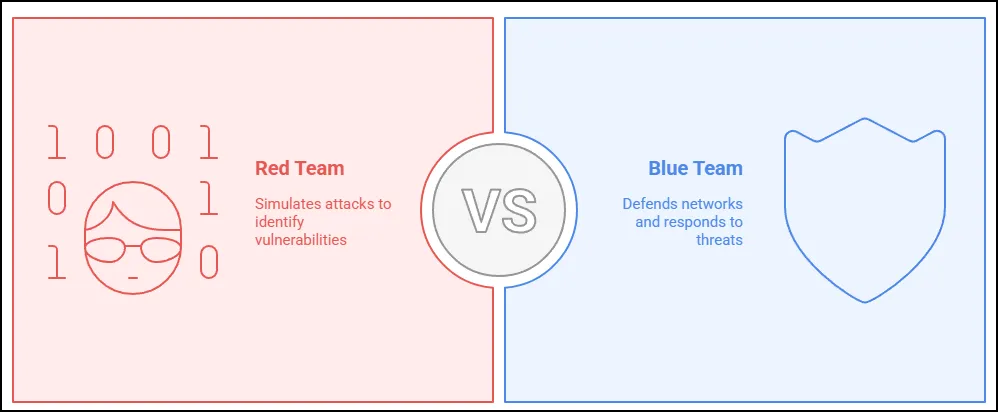
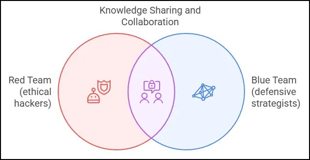
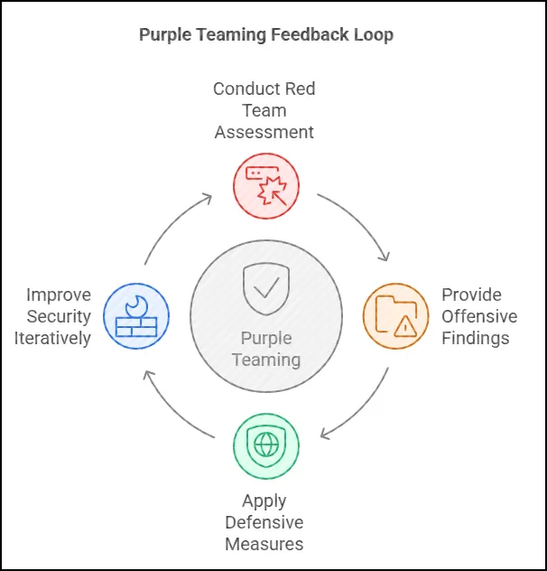
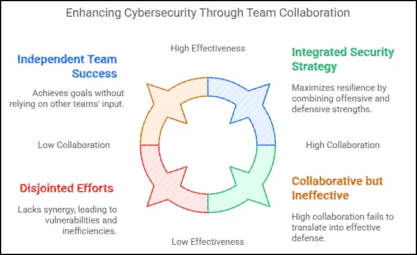

# Introduction to Purple Teaming

### Summary

In the world of cybersecurity, the traditional "Red Team vs. Blue Team" approach has long been the standard for testing and improving an organization’s security posture. Red Teams, composed of ethical hackers, simulate real-world attacks to identify vulnerabilities, while Blue Teams focus on defending networks and responding to threats. However, as cyber threats have become more sophisticated, the need for a more collaborative approach has given rise to **Purple Teaming**—a hybrid strategy that enhances security by fostering cooperation between offensive (Red Team) and defensive (Blue Team) efforts.

Purple Teaming bridges the gap between attack and defense by ensuring that both teams work together in real-time to enhance detection and response capabilities. Rather than treating security testing as a competition, this approach emphasizes knowledge sharing, allowing defenders to gain insights into attack techniques and adversaries' methodologies. By doing so, organizations can proactively refine their security measures, improve incident response times, and reduce vulnerabilities more effectively.

One of the key benefits of Purple Teaming is the continuous feedback loop it creates. Instead of waiting for periodic Red Team assessments, organizations can use a Purple Team model to iteratively improve their security by immediately applying defensive measures based on offensive findings. This proactive approach is particularly valuable for industries that handle sensitive data, such as finance, healthcare, and government sectors, where minimizing the window of exposure to threats is crucial.

Ultimately, Purple Teaming is not about replacing Red and Blue Teams but rather enhancing their effectiveness through collaboration. By integrating offensive and defensive security efforts, organizations can develop a more resilient security posture, making it harder for attackers to exploit weaknesses. As cyber threats continue to evolve, adopting a Purple Team mindset ensures that organizations stay ahead of adversaries through continuous learning, adaptation, and improvement.

## Exercise Setup

These exercises assume that at a minimum you have a Kali/Kali Purple and a Windows VM and Elastic and/or Splunk set up in your lab.