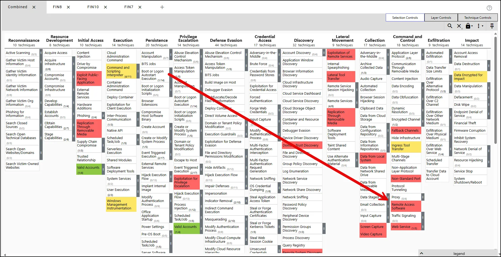
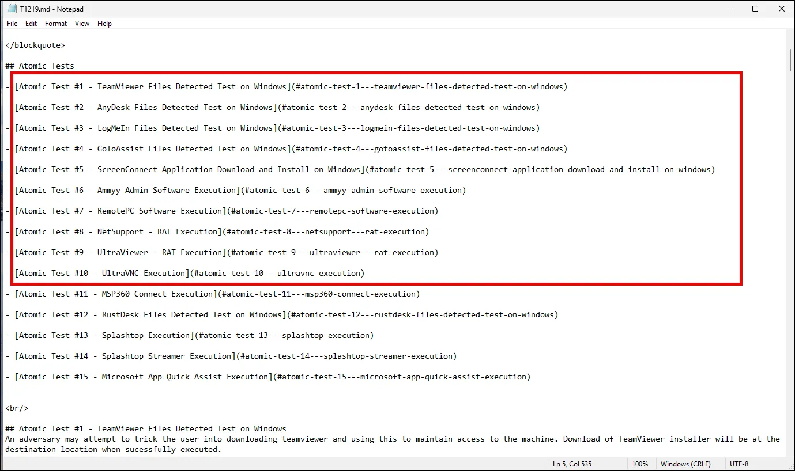
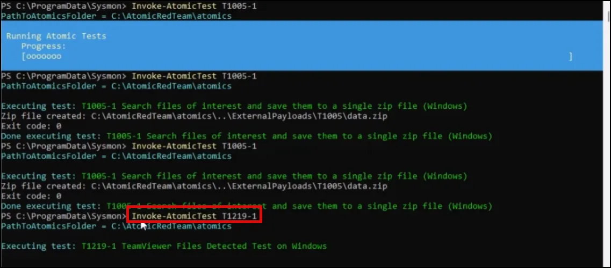
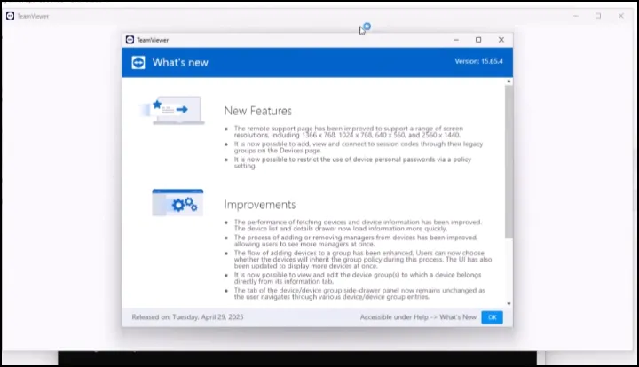
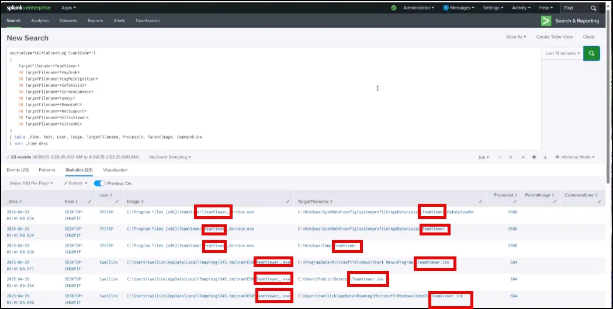

# Emulating FIN Actors: Part 4 Atomic Red Team (T1219)

## Introduction

Going back to our ATT&CK navigator layer we created for FIN actors, we will select the next Atomic Red Team atomic to test, T1219.



# **Remote Access Tools: Remote Desktop Software (T1219.002)**

An adversary may use legitimate desktop support software to establish an interactive command and control channel to target systems within networks. Desktop support software provides a graphical interface for remotely controlling another computer, transmitting the display output, keyboard input, and mouse control between devices using various protocols. Desktop support software, such as `VNC`, `Team Viewer`, `AnyDesk`, `ScreenConnect`, `LogMein`, `AmmyyAdmin`, and other remote monitoring and management (RMM) tools, are commonly used as legitimate technical support software and may be allowed by application control within a target environment.

The screenshot below is from the T1219 atomics document that shows the tests for this technique. We will focus on those Remote Access Software packages identified in tests 1-10.



## Launch Atomic

```json
Invoke-AtomicTest T1219-1
```



When the test is completed TeamViewer will open on your screen.



Minimize Team Viewer and go back to Splunk.

## Check for Coverage

The SPL below is designed to **detect the creation of files related to known remote access tools** (RATs) — specifically tools often used for **remote support or malicious C2 access** — using **Sysmon Event ID 11**, which logs **file creation** events.

```json
sourcetype=XmlWinEventLog EventCode=11 
(
    TargetFilename=*TeamViewer*
    OR TargetFilename=*AnyDesk*
    OR TargetFilename=*LogMeInIgnition*
    OR TargetFilename=*GoToAssist*
    OR TargetFilename=*ScreenConnect*
    OR TargetFilename=*ammyy*
    OR TargetFilename=*RemotePC*
    OR TargetFilename=*NetSupport*
    OR TargetFilename=*UltraViewer*
    OR TargetFilename=*UltraVNC*
)
| table _time, host, user, Image, TargetFilename, ProcessId, ParentImage, CommandLine
| sort _time desc

```

As seen below the SPL was successful at detecting TeamViewer



You can run additional Atomic Red Team tests (T1219-2 through T1219-10) and use the same SPL. You should get similar results.

Additionally, use the same process we covered in the previous two lessons to create an alert and add it to your Dashboard.
