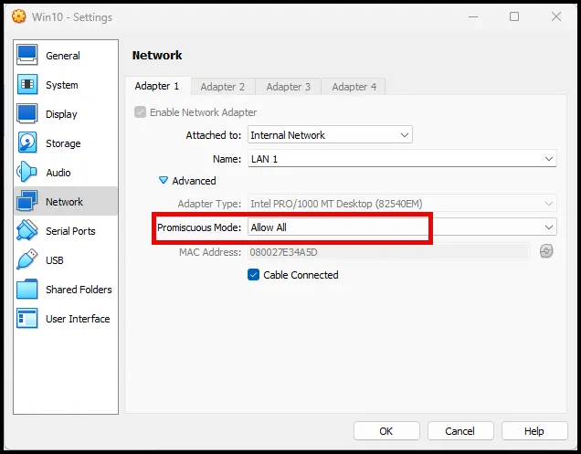
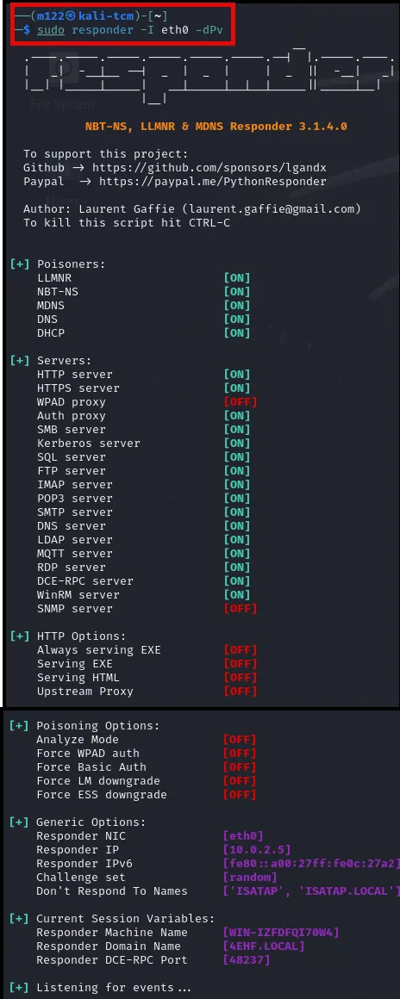
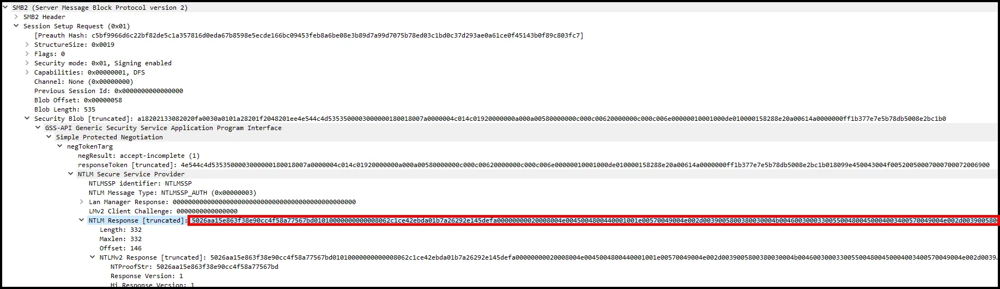

# Purple Team Exercise #3 LLMNR Poisoning

## (ATT&CK Technique T1557.001)

## Summary

During this exercise we will play the role of both the Red Team and the Blue Team. We will conduct the attack, LLMNR poisoning, and then transition to a Blue Team role and detect the Red Team actions. Lastly, we will recommend mitigation procedures to prevent LLMNR poisoning.

## Background

### LLMNR

LLMNR (Link-Local Multicast Name Resolution) is a protocol used in Windows networks to resolve hostnames to IP addresses on a local network segment when DNS or WINS servers are unavailable. It operates within the link-local scope and uses multicast to broadcast queries to other devices on the same network, allowing them to respond if they recognize the hostname.

### LLMNR Poisoning

LLMNR poisoning is a type of attack where an attacker exploits the LLMNR (Link-Local Multicast Name Resolution) protocol to intercept or redirect network traffic. When a device on the network sends an LLMNR query to resolve a hostname, an attacker can respond with a spoofed reply, providing a malicious IP address instead of the legitimate one. This tricks the querying device into sending its traffic to the attacker's system. LLMNR poisoning is often used in credential theft attacks, where attackers capture usernames and hashed passwords sent during authentication attempts, which can then be cracked offline to gain unauthorized access to network resources.

LLMNR Poisoning is MITRE ATT&CK Technique #T1557.001. 


## Lab Setup

This lab requires an Active Directory domain. If you set up the virtual lab environment provided in the series of walkthroughs on the schedule notion page, the only change is moving the Kali Linux VM to the ECorp LAN. This can be done by simply changing the adaptor from LAN 0 to LAN 1.


This changes the lab environment to the diagram below. 


The IP address of the Kali box is now in the same range as the other VMs in the ECorp LAN. 

In order to do full packet capture, ensure the network adaptor on your Windows victim VM is set to promiscous mode.



## Red Team Attack

Before the attack, start Wireshark on the Windows victim VM.

We will be using the tool Responder. Responder is a powerful and widely-used tool designed to exploit weaknesses in network protocols such as LLMNR (Link-Local Multicast Name Resolution), NBT-NS (NetBIOS Name Service), and MDNS (Multicast DNS). It works by intercepting and responding to broadcasted network requests for name resolution that occur when legitimate DNS queries fail. By positioning itself as the target server, Responder captures user credentials (e.g., NTLM hashes) when devices on the network unknowingly communicate with it

On the Kali machine open Responder with the following command:

```go
sudo responder -I eth0 -dwv
```

The command `sudo responder -I eth0 -dwv` instructs Responder to perform the following actions:

- `sudo`: This part of the command runs Responder with superuser privileges, which is necessary for it to interact with the network interface at a low level.
- `I eth0`: This specifies the network interface that Responder should use. In this case, `eth0` is the interface through which Responder will listen for and respond to network traffic.
- `d`: This flag enables the DNS (Domain Name System) poisoning attack. Responder will respond to DNS queries and can potentially redirect traffic intended for legitimate servers to the attacker's machine.
- `w`: This option enables the WPAD (Web Proxy Auto-Discovery Protocol) attack. WPAD allows Responder to capture credentials by responding to WPAD requests on the network.
- `v`: This flag enables verbose mode, meaning Responder will provide detailed output, showing more information about its operations and the responses it sends.

In summary, this command configures Responder to actively listen on the `eth0` interface, respond to DNS and WPAD queries, and run in verbose mode to provide detailed output. This setup is typically used to capture credentials and gather detailed information during a penetration test.



On the victim machine (pprice in this case) attempt to connect to the domain controller; however, there is a typo. Instead of EVILCORP-DC (the correct name of the domain controller) type EVILCORP-DCC. 


On the attacker machine we see the username and password hash is captured.


We can crack the hash on our Kali VM by using hashcat. 

```go
pprice::ECORP:a10ec84a8b3e7643:5E3368D34E2BEA05441AFE754AF1CAC8:010100000000000000039D7531EBDA01BE8B16812505E1A60000000002000800340045004800460001001E00570049004E002D0049005A0046004400460051004900370030005700340004003400570049004E002D0049005A004600440046005100490037003000570034002E0034004500480046002E004C004F00430041004C000300140034004500480046002E004C004F00430041004C000500140034004500480046002E004C004F00430041004C000700080000039D7531EBDA01060004000200000008003000300000000000000001000000002000001A2B3E0B63196BFFACF6DE5B60FDBF241E9E3F7922FE3C6178EED88C70A6ED6C0A0010000000000000000000000000000000000009001A0063006900660073002F00310030002E0030002E0032002E0035000000000000000000
```

Copy the hash and put it into a txt file.

```go
nano hashes.txt 
```

and paste in the copied hash.


Save and Exit nano.

### Hashcat

Hashcat is a highly versatile and powerful password recovery tool used for cracking hashed passwords through brute-force, dictionary, hybrid, and other advanced attack methods. It supports a wide range of hashing algorithms, including those used for system passwords, encryption, and cryptographic applications. Hashcat is designed to utilize the computational power of CPUs, GPUs, and distributed systems, making it one of the fastest and most efficient password-cracking tools available. It is widely used by security professionals and penetration testers to assess the strength of passwords and identify vulnerabilities in password security.

Hashcat requires a module number to crack the password. The module number is for the type of password. We know we captured a NTLMv2 password. To find the module number we can run the command below and pipe it to grep searching for NTLMv2.

```go
hashcat - -help | grep NTLMv2
```


As seen above the module number is 5600.

We can now craft the command to crack the hash. As seen below, we are using the rockyou wordlist.

```go
hashcat -m 5600 hashes.txt /usr/share/wordlists/rockyou.txt.gz

```


As seen above the password was cracked and was “Password1”. If the password was previously cracked we can use the - -show command as seen below. 


### Blue Team

Since network traffic contains so much noise (all regular web traffic for example), performing network forensics to pinpoint anomalies becomes difficult due to the sheer amount of traffic in enterprise environments. However, knowing that LLMNR runs on UDP port 5355 by default, we can begin our detection by filtering for it. 

```go
udp.port==5355 and ip
```


By examining the source and destination IPs, we observe that the IP address 10.0.2.9 issued a DNS query for 'EVILCORP-DCC,' and the IP address 10.0.2.5 responded to that query.

It appears that the query was intended for 'EVILCORP-DC,' but a typo was made, resulting in 'EVILCORP-DCC' being queried instead. This suggests that the user intended to access a file share on EVILCORP-DC but mistakenly typed 'EVILCORP-DCC.' Consequently, when the DNS server failed to resolve the incorrect hostname, the LLMNR protocol was used for name resolution. At this point, the attacker's rogue server impersonated 'EVILCORP-DCC' and captured the credentials.

Typically, the IP address responding to such queries should belong to the Domain Controller. In this scenario, the legitimate DC IP is 10.0.2.8, but the response came from a different IP, 10.0.2.5, which raises suspicion and warrants further investigation.

To confirm our theory, we will analyze the SMB traffic.

At this stage, it's crucial to verify whether the IP address 10.0.2.5 belongs to a rogue device, as we currently suspect it may be controlled by attackers. Let's remove the Wireshark filter and apply a filter for DHCP.

Upon reviewing the DHCP request between the suspicious IP and the DHCP server, we can identify the hostname of the machine that was assigned the IP address 10.0.2.5.


The hostname is kali-tcm, Kali an offensive Linux distribution used by hackers and [pentesters](https://www.hackthebox.com/blog/how-to-become-a-pentester). This confirms that this machine is not any domain-joined machine and needs further investigation.

**Evidence of credential stealing in SMB traffic**

Now we’ll analyze SMB traffic to find credentials being stolen and sent over to the attacker’s Kali Linux machine.

Let's start over by adding an smb2 filter in Wireshark.


We can see two NTLM Authentication Negotiations. To only see negotiation packets and not other SMB packets, add a filter for “ntlmssp”. We will apply this filter first and then go back to viewing full SMB traffic.


- We can see that authentication is taking place for the domain-joined user called “pprice”
- One other pattern we can spot is that multiple occurrences of NTLM authentications can be seen occurring within seconds of each other.

By default we cannot see the IPs, to view them go to View > Name resolution and enable Resolve Network Addresses. 


This will now display hostnames.


One thing to note is that EVILCORP-DCC is not an actual host in the network, Wireshark decoded the Attacker’s Kali hostname as EVILCORP-DCC in smb traffic because the victim machine (pprice.local) thinks the Kali machine is the EVILCORP-DCC host (the typo the victim made).

This confirms our findings so far that the credentials got stolen by the attacker from pprice. In summary we can tell what happened.

1. The victim wanted to visit \\EVILCORP-DC but instead made a typo (\\EVILCORP-DCC) which failed the hostname resolution.
2. When the DNS server was not able to resolve EVILCORP-DCC (as it does not exist), Windows tried using LLMNR to resolve this.
3. The attacker was running a tool called Responder in the network which acts as an LLMNR server and it responded to the LLMNR query by the victim machine.
4. The victim's machine sent the hash to authenticate thinking it was a domain controller, but in reality, it was an attacker-controlled server.
5. On the victim’s side, nothing seems out of the ordinary. When file share does not open, the victim realizes they made a typo and they type in the correct path and carry on as usual. 

We can see all above activity occured in under a minute.

### Recovering the Hash from the PCAP File

This step is important because it allows us to determine how difficult it is for the attacker to crack the compromised user hash.

If the password policy is strict in your organization, there’s a high chance the attacker failed to crack the password. The impact of this attack is therefore reduced thanks to the complex password policy.

Go to NTLM authentication traffic (ntlmssp filter). The NTLM authentication and negotiation occur in sets of three (3) packets. Each negotiation includes an:

1. NTLMSSP_NEGOTIATE packet.
2. NTLMSSP_CHALLENGE packet.
3. NTLMSSP_AUTH packet.

To recover the hash, we need to dissect 1 set. Let’s do this on the first set. We need different values from the negotiations and to plug in the values in this format.


**Format**

User::Domain:ServerChallenge:NTProofStr:NTLMv2Response(without first 16 bytes/32 characters).

To find each value:

**User:** In details of NTLMSSP_NEGOTIATE packet expand SMB2 (Server Message Block Protocol Version 2) ->SMB2 Header -> Session ID->Account.


We will start to compile the format to crack the hash.

```go
pprice::
```

**Domain:** In details of NTLMSSP_NEGOTIATE packet expand SMB2 (Server Message Block Protocol Version 2) ->SMB2 Header -> Session ID->Domain.


```go
pprice::ECORP
```

**ServerChallenge:** In details of the NTLMSSP_CHALLENGE PACKET  expand SMB2 (Server Message Block Protocol Version 2) -> Session Setup Response (0x1) -> Security Blob -> GSS-API Generic  -> Simple Protected Negotiation -> negTokenTarg -> NTLM Secure Service Provider -> NTLM Server Challenge.


```go
pprice::ECORP:bb31b603cf71f7ba:
```

**NtProofStr:**  In details of the NTLMSSP_AUTH Packet expand SMB2 (Server Message Block Protocol Version 2) -> Session Setup Response (0x1) -> Security Blob -> GSS-API Generic **** -> Simple Protected Negotiation -> negTokenTarg -> NTLM Secure Service Provider -> -> NTLM Response -> NTLMv2 Response ->NTProofStr.

**NTLMV2Response:** In details of the NTLMSSP_AUTH Packet expand SMB2 (Server Message Block Protocol Version 2) -> Session Setup Response (0x1) -> Security Blob -> GSS-API Generic **** -> Simple Protected Negotiation -> negTokenTarg -> NTLM Secure Service Provider -> -> NTLM Response -> NTLMv2 Response.


```go
pprice::ECORP:bb31b603cf71f7ba:5026aa15e863f38e90cc4f58a77567bd:
```

Note: You have to remove first 32 characters from the value of this field because the first 32 characters are the same as NTProofStr, which we already have acquired and is ready to be plugged in the hash format for cracking.



```go
pprice::ECORP:bb31b603cf71f7ba:5026aa15e863f38e90cc4f58a77567bd:01010000000000008062c1ce42ebda01b7a26292e145defa00000000020008004e0045004800440001001e00570049004e002d0039005800380030004b0046003000330055004800450004003400570049004e002d0039005800380030004b004600300033005500480045002e004e004500480044002e004c004f00430041004c00030014004e004500480044002e004c004f00430041004c00050014004e004500480044002e004c004f00430041004c00070008008062c1ce42ebda01060004000200000008003000300000000000000001000000002000001a2b3e0b63196bffacf6de5b60fdbf241e9e3f7922fe3c6178eed88c70a6ed6c0a001000000000000000000000000000000000000900220063006900660073002f004500560049004c0043004f00520050002d004400430043000000000000000000
```

Paste the above value into notepad++


This is the final format and we save it as a txt file, hashes.txt.

We can crack it with hashcat the same way we did in the Red Team section.


Obviously, if we can crack it by reconstructing it from the pcap, and attacker can easily crack the password.

### Mitigating LLMNR Poisoning

The best defense against LLMNR is to disable LLMNR and NBT-NS.

**Disable LLMNR via Group Policy**

On your DC under Tools, select Group Policy Management


Right click the domain ECORP.local and select Create a GPO in this domain, and Link it here.


Name it.


Right click the name and select Edit…


Drop down Policies —>Administrative Templates—>Network


Under Network select DNS Client and then scroll to the bottom of the settings and select Turn off multicast name resolution. 


Select Enabled and then OK.


**Disable NBT-NS**

On the host, navigate to Network Connections > Network Adapter Properties > TCP/IPv4 Properties > Advanced tab > WINS tab and select "Disable NetBIOS over TCP/IP".


### If an organization can not disable LLMNR/NBT-NS, the best course of action is to:

1. **Require Network Access Control.** 

Requiring Network Access Control (NAC) can help mitigate Link-Local Multicast Name Resolution (LLMNR) poisoning by implementing stricter control over which devices can connect to the network and ensuring that only authorized and properly configured devices are allowed. Here's how NAC contributes to mitigating LLMNR poisoning:

**Device Authentication**: NAC requires devices to authenticate before they can access the network. Unauthorized devices, which might be used for LLMNR poisoning attacks, are prevented from joining the network in the first place.

**Endpoint Compliance**: NAC can enforce security policies on devices before granting them access. For example, it can check if LLMNR is disabled on endpoints or if the endpoint has the necessary security patches applied to mitigate vulnerabilities that could be exploited for LLMNR poisoning.

**Network Segmentation**: NAC can be used to segment the network based on device type, user role, or other criteria. This segmentation limits the spread of LLMNR traffic, reducing the chances of a successful LLMNR poisoning attack by isolating vulnerable devices from potential attackers.

**Monitoring and Logging**: NAC solutions often include monitoring and logging capabilities, which can be used to detect abnormal network behaviors associated with LLMNR poisoning attempts. Early detection can lead to quicker responses to potential attacks.

**Preventing Rogue Devices**: By preventing rogue devices (which might be used by attackers for LLMNR poisoning) from gaining network access, NAC reduces the overall risk of such attacks occurring on the network.

By combining these NAC capabilities, organizations can significantly reduce the risk of LLMNR poisoning, enhancing their overall network security posture.

1. **Require strong user passwords.**

Requiring strong user passwords, such as those with more than 14 characters and limited use of common words, helps mitigate the effects of LLMNR poisoning by making it more difficult for attackers to exploit the hashes they capture during such an attack. Here's how this works:

1. **Increased Hash Cracking Difficulty**: LLMNR poisoning often leads to attackers capturing NTLM (NT LAN Manager) hashes of passwords. If a user’s password is weak or commonly used, these hashes can be cracked relatively quickly using techniques like dictionary attacks, brute-force attacks, or rainbow tables. However, if the password is long and complex, the computational effort required to crack the hash increases exponentially, making it significantly more difficult and time-consuming for the attacker to obtain the actual password.
2. **Reduced Effectiveness of Precomputed Attacks**: Attackers often use precomputed hash databases (like rainbow tables) that are designed to quickly reverse common password hashes into plaintext passwords. By using passwords that are long, complex, and include uncommon character combinations, you reduce the likelihood that a captured hash will match one in the attacker’s precomputed databases.
3. **Deterrence Against Targeted Attacks**: In targeted attacks, where an attacker is specifically trying to compromise a particular account, having a strong password can act as a deterrent. The attacker might move on to other, less difficult targets if they find that cracking the hash of a strong password is too time-consuming or resource-intensive.
4. **Limiting Damage**: Even if LLMNR poisoning is successful and an attacker captures a password hash, a strong password makes it less likely that the attacker will be able to quickly use that hash to authenticate as the user. This buys time for detection and response efforts to take place, potentially preventing the attacker from achieving their objectives.

In summary, while strong passwords don't prevent LLMNR poisoning itself, they significantly mitigate the potential damage by making it much harder for attackers to exploit the captured credentials.