# Purple Team Exercise 3 Part 3 (Snort Custom Rule)

### **Summary**

We will create a custom Snort rule designed to detect LLMNR poisoning. During part two we were not able to create a detection in our SIEMs because the only logs  we are ingesting are Sysmon and PowerShell logs. We have no network traffic logs, such as Zeek. However, if you are using pfSense in your lab environment, we can enable Snort and create a custom rule for LLMNR poisoning. 

### Background

Snort is an open-source Intrusion Detection System (IDS) and Intrusion Prevention System (IPS) owned and maintained by Cisco Systems. It is one of the most widely used tools in cybersecurity for real-time traffic analysis and packet logging on IP networks. This walkthrough provides a brief introduction to Snort and covers how to install it on pfSense in our virtual environment. Lastly, we will demonstrate its functionality by creating a custom rule for potential LLMNR poisoning.

### Lab Requirements

Must have pfSense installed in your lab environment. 

### **Snort Key Features:**

1. **Real-time Traffic Analysis:** Snort inspects incoming and outgoing packets to detect malicious activities like denial-of-service (DoS) attacks, buffer overflows, port scans, and more.
2. **Packet Sniffer:** It can capture and log network packets for further analysis.
3. **Signature-Based Detection:** Snort uses a set of predefined rules (signatures) to identify known threats. The Snort Community Ruleset and subscription services provide frequent updates.
4. **Custom Rules:** Security administrators can create custom rules tailored to their environment, enabling Snort to detect unique threats.
5. **Multiple Modes:**
    - *Sniffer Mode*: Reads and displays network traffic in real-time and displays them in the console.
    - *Packet Logger Mode*: Saves captured packets to disk for future review.
    - *Network Intrusion Detection Mode*: Analyzes traffic against signature rules to generate alerts.
    
    This walkthrough will focus on the Network Intrusion Detection Mode and will be configured in pfSense..
    

### **Use Cases:**

- Network security monitoring
- Intrusion prevention (blocking malicious traffic)
- Incident response and forensics
- Compliance with security policies

### **Strengths:**

- Highly customizable and adaptable to different environments.
- Large, active community offering support, rules, and tutorials.
- Lightweight and efficient, capable of handling high-traffic networks.

### **Limitations:**

- Signature-based detection may struggle with zero-day attacks or encrypted traffic.
- Can generate false positives, requiring fine-tuning of rules.
- High-performance networks may require optimization to handle traffic volume.

Snort is commonly deployed in enterprise networks as part of a defense-in-depth strategy and can be integrated with other security tools like firewalls, SIEM systems, and log management solutions.

## Enable Snort on pfSense

If you already have Snort enabled, go down to the LLMNR rule section. 

Open pfSense dashboard and dropdown the System menu and select Package Manager.

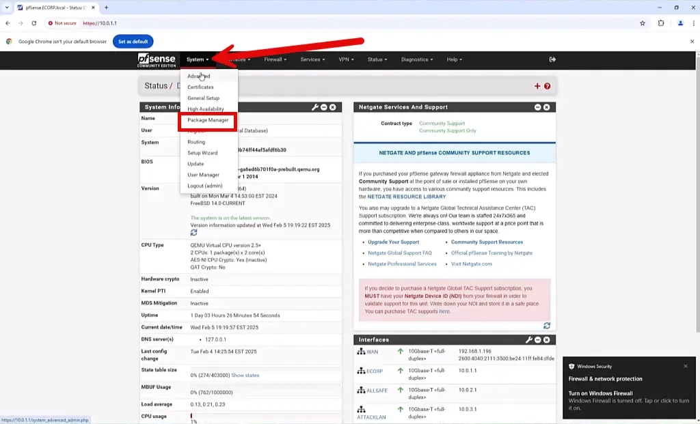

Select the “Available Packages” menu and search for “snort”. Select the “Install” button.

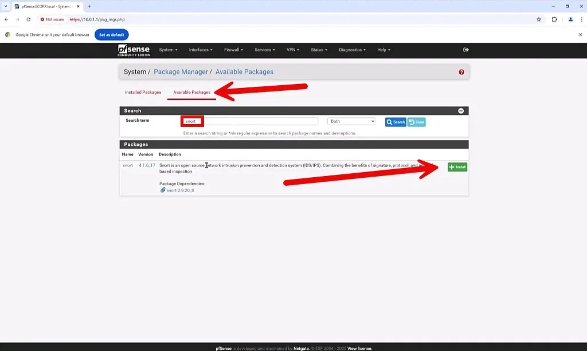

Confirm the install.


When completed you will get a “Success” message.

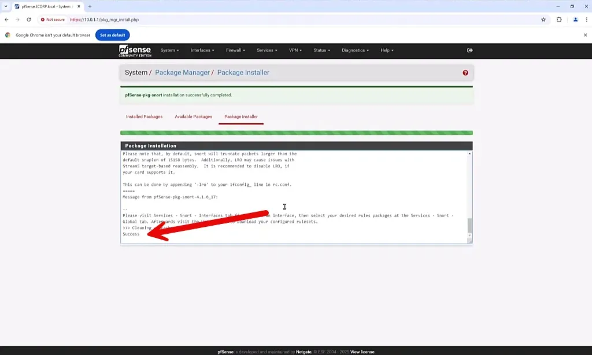

Select the “Service” dropdown and select Snort.

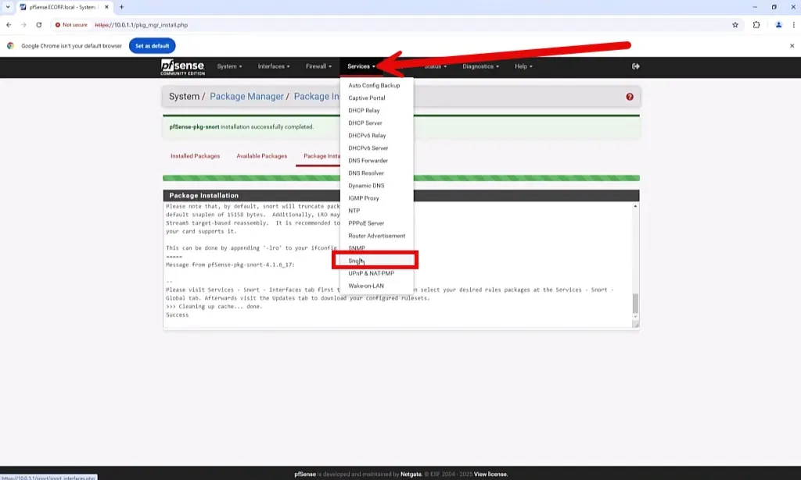

## Configure Interface

We will install Snort on the ECORP interface of pfSense. This will allow access to all packets going outside and inside of the ECORP network.

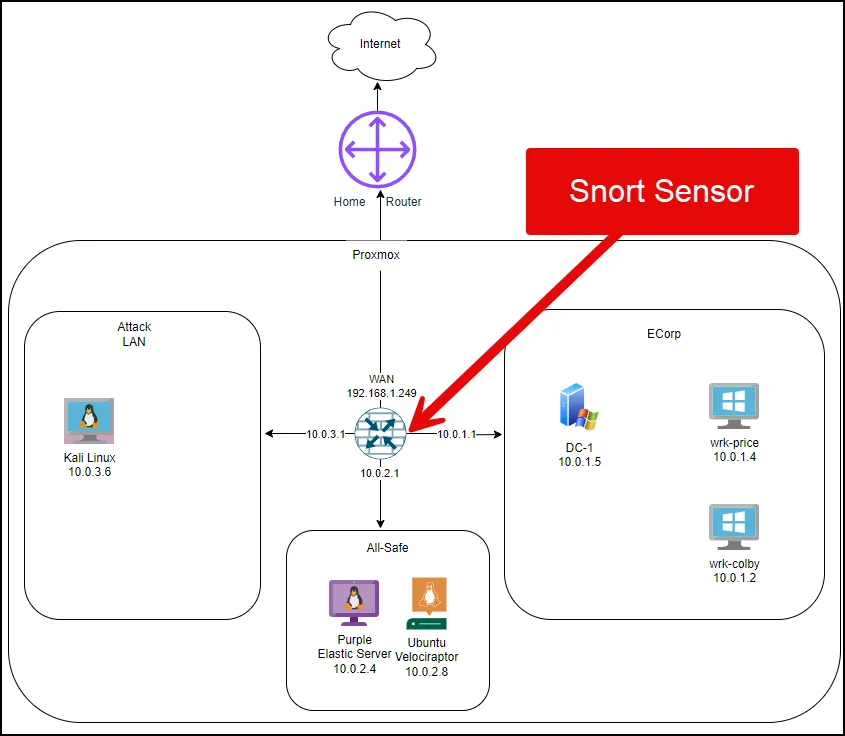

Select Snort Interfaces and then select the “Add” button. 

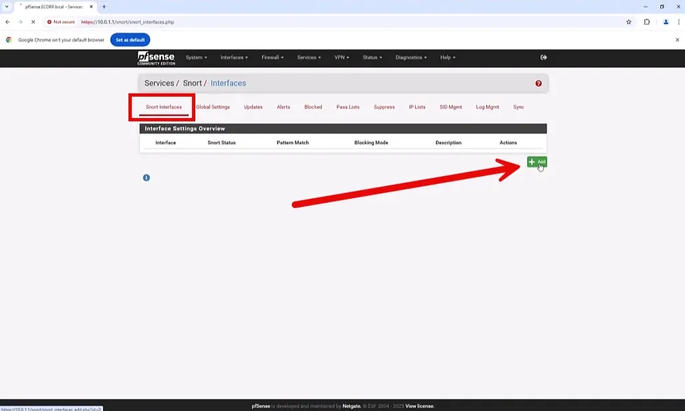

In the General Settings section, select the interface drop down and select ECORP.

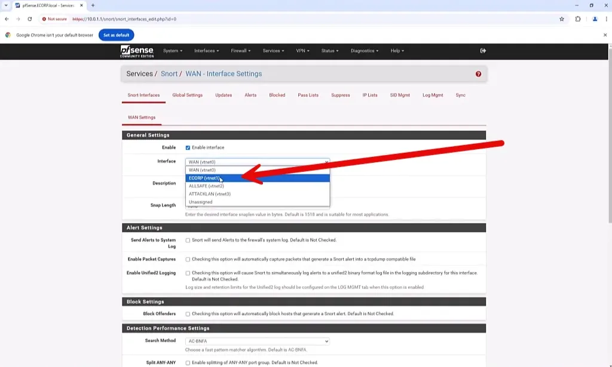

Keep all the defaults and then select “Save”.

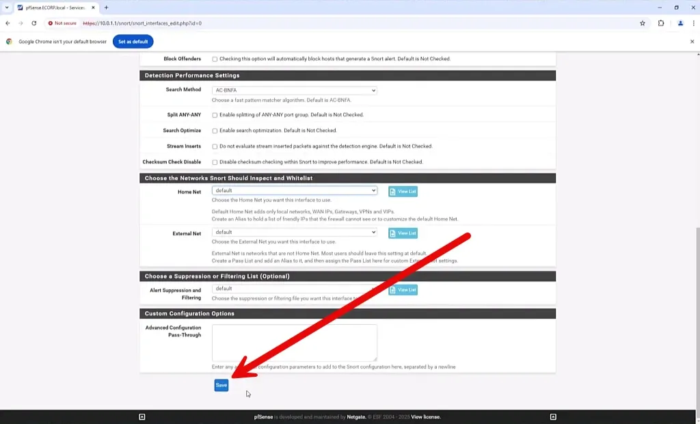

## Create LLMNR Rule

In the Snort Interfaces menu, go to ECORP interface and select the edit icon.

 

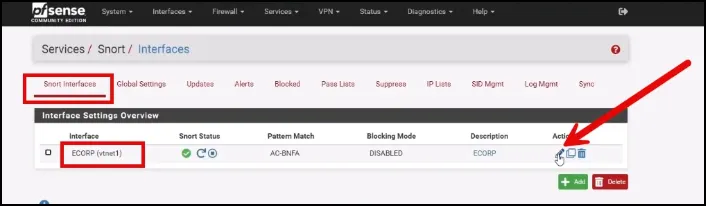

Select ECORP Rules menu. Ensure the custom.rules is selected in the Category Selection drop down.

Before figuring out how to write the rule we can revisit how LLMNR and LLMNR poisoning works.

LLMNR (Link-Local Multicast Name Resolution) is a protocol used in Windows networks to resolve hostnames to IP addresses on a local network segment when DNS or WINS servers are unavailable or the local Domain Controller does not have the DNS record. It operates within the link-local scope and uses multicast to broadcast queries to other devices on the same network, allowing them to respond if they recognize the hostname.

LLMNR poisoning is a type of attack where an attacker exploits the LLMNR (Link-Local Multicast Name Resolution) protocol to intercept or redirect network traffic. When a device on the network sends an LLMNR query to resolve a hostname or resource, an attacker can respond with a spoofed reply, providing a malicious IP address instead of the legitimate one. This tricks the querying device into sending its traffic to the attacker's system. LLMNR poisoning is often used in credential theft attacks, where attackers capture usernames and hashed passwords sent during authentication attempts, which can then be cracked offline to gain unauthorized access to network resources.

We will base our rule on two things, the Broadcast IPv4 address 224.0.0.252 and the LLMNR protocol port 5355. 

```jsx
alert udp any any -> 224.0.0.252 5355 (msg:"Potential LLMNR Poisoning"; classtype:protocol-command-decode; sid:1000011; rev:1;)
```

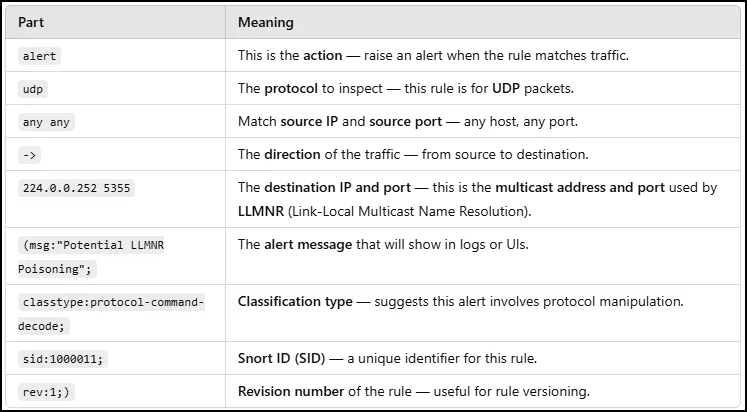

 This rule alerts you whenever an LLMNR request is sent.

---

## Testing the LLMNR Rule

### Snort as an IDS

Ensure that the Snort interface is enabled by selecting the “play” button from the Snort Interfaces menu.

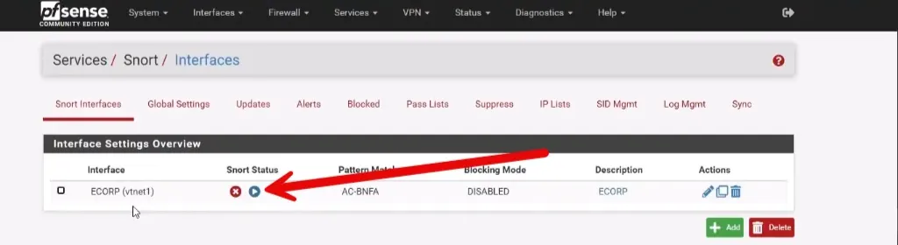

There will be a green arrow once the interface is enabled.

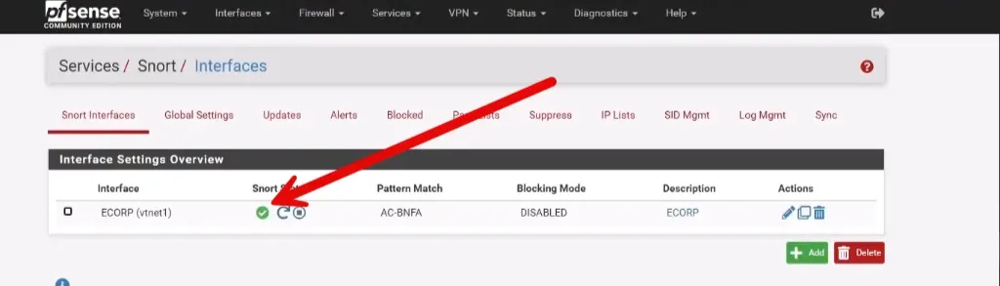

Ensure responder is running on Kali Linux. 

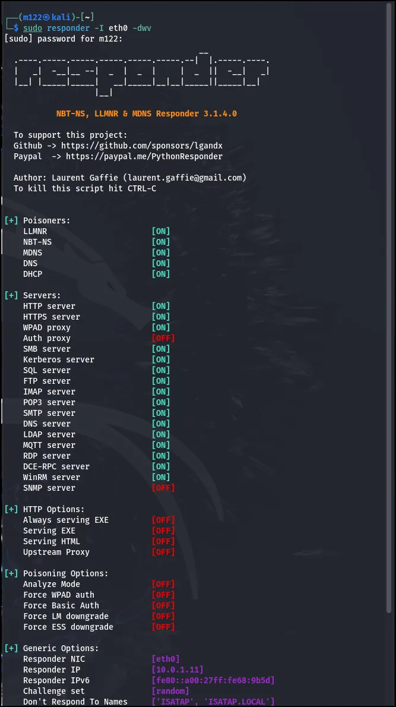

Go back to the victim machine and attempt to connect to \\E-CORP-DCC.

 

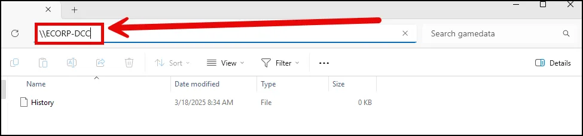

Provide the credentials when prompted.

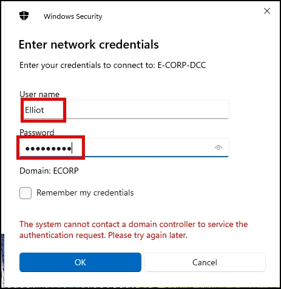

Go to the Snort alerts tab in pfSense (Services/Snort/Alerts) as seen below. You should see the alert was triggered.

 

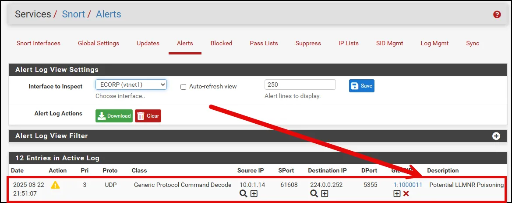

### Conclusion

We have demonstrated that we are able to create detection rules based on network data using Snort. For more information on Snort visit the Network Analysis section.