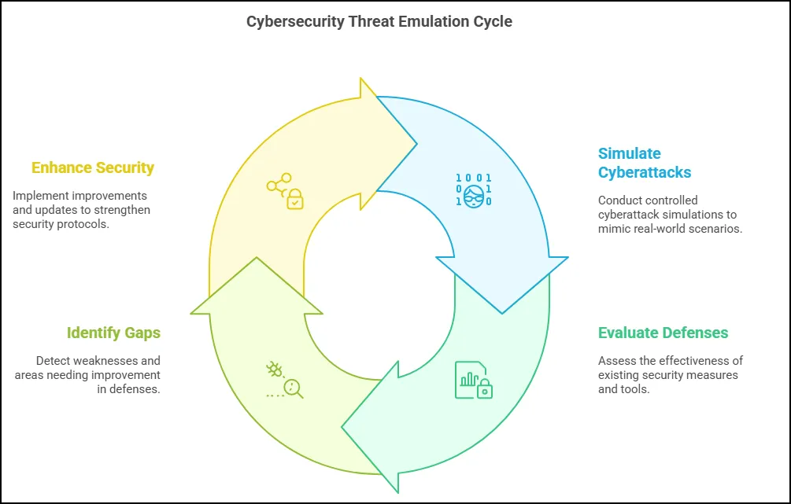
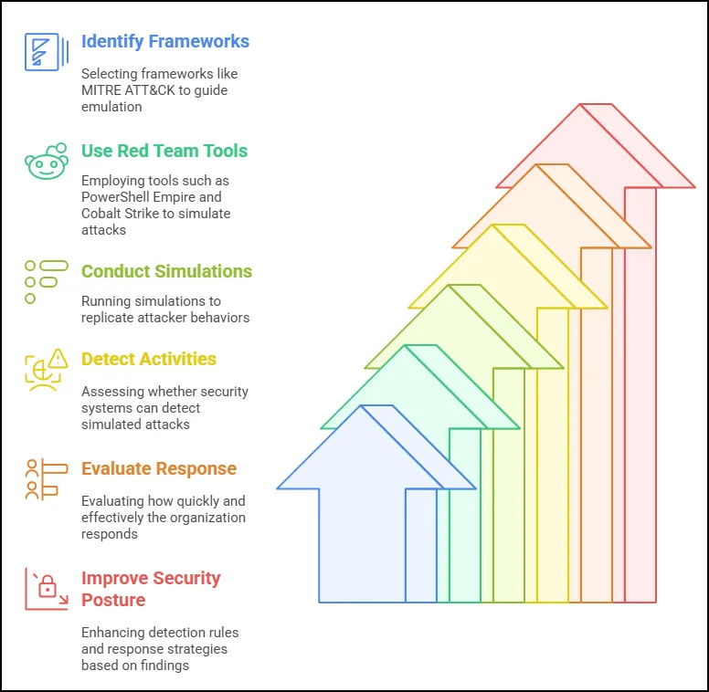
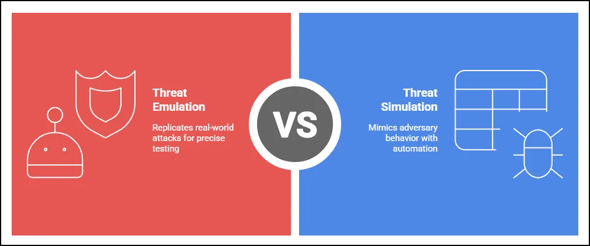
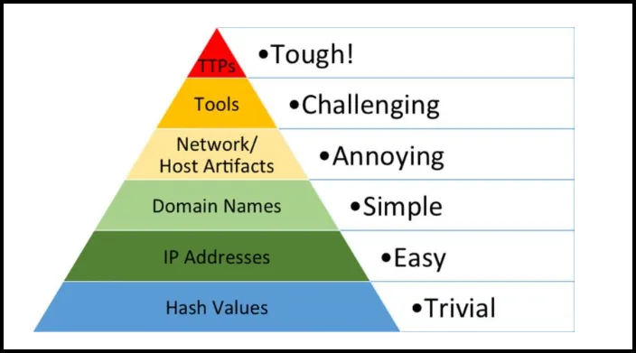
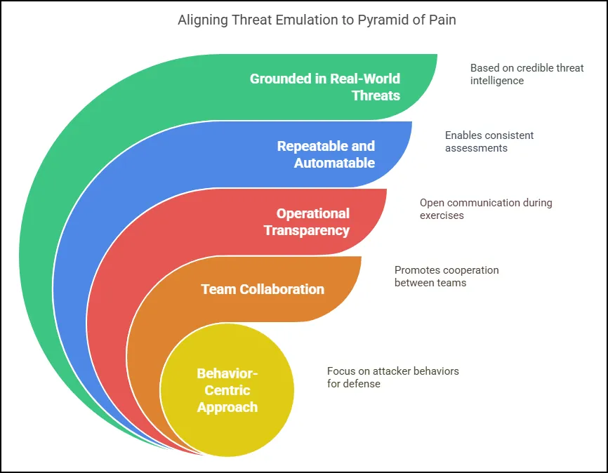
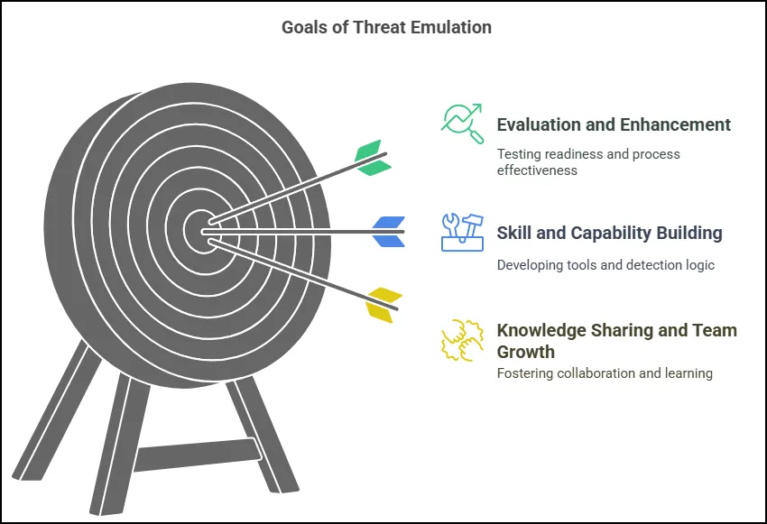
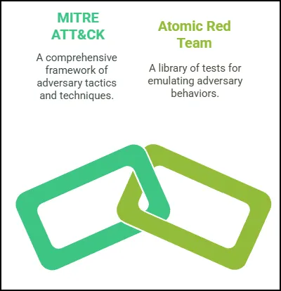
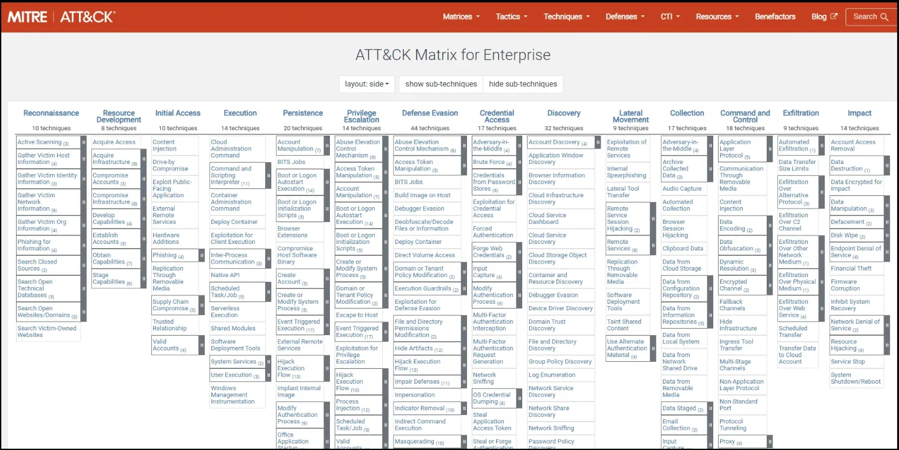
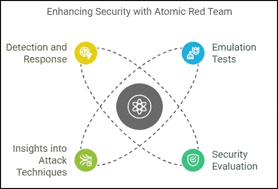

# Threat Emulation

## Background

In a **purple team** setting, **threat emulation** plays a central role by acting as the bridge between offensive (red team) and defensive (blue team) efforts. The purpose of a purple team is to promote collaboration between these two sides, and threat emulation provides the structured, realistic scenarios needed for that collaboration to be meaningful and productive.

**How it's used:**

- **Shared Emulation Exercises:** The red team uses threat emulation to replicate real-world adversary TTPs (tactics, techniques, and procedures), often based on frameworks like MITRE ATT&CK. These activities are carried out in coordination with the blue team, either in real time or through structured phases.
- **Immediate Feedback Loop:** As the emulated threats unfold, the blue team monitors, detects, and responds—while the red team provides immediate feedback on what actions were taken and how the adversary would adapt. This allows for live tuning of defenses and logging mechanisms.
- **Joint Detection Development:** Blue teams can observe how attacks manifest in logs and telemetry, allowing them to build or improve detection rules and alerts. This is especially effective when both teams analyze gaps together.
- **Improving Response Playbooks:** By observing how the blue team responds to various stages of the emulated attack, the organization can refine its incident response procedures and train teams to react faster and more effectively.
- **Knowledge Sharing:** Unlike traditional red team engagements, where findings are revealed at the end, threat emulation in purple teaming encourages ongoing knowledge transfer, helping both teams understand attacker behaviors and improve defensive strategies in real time.

## Introduction

Cybersecurity threat emulation is the practice of simulating real-world cyberattacks in a controlled environment to test how effectively an organization can detect and respond to threats. Unlike penetration testing, which primarily focuses on finding vulnerabilities in systems or applications, threat emulation aims to mimic the tactics, techniques, and procedures (TTPs) used by actual threat actors. This allows security teams to evaluate the performance of their defenses, such as endpoint detection and response (EDR) tools, SIEMs, and incident response processes.

Threat emulation often uses frameworks like MITRE ATT&CK to replicate specific attacker behaviors, such as privilege escalation, lateral movement, command and control, and data exfiltration. It may also involve the use of red team tools like PowerShell Empire, Cobalt Strike, Metasploit, or Atomic Red Team to carry out these simulations. The goal is to determine whether the security infrastructure can detect these activities and how quickly the organization can respond. By conducting regular threat emulation exercises, organizations can uncover blind spots, improve detection rules, and ensure that their response teams are prepared for real-world attack scenarios.

## Threat Emulation vs Threat Simulation

The cybersecurity industry lacks a universally accepted definition for this discipline, as terminology often varies. Terms like *threat emulation*, *adversary emulation*, *attack simulation*, and *purple teaming* are frequently used interchangeably. In this course, we’ll use *threat emulation* and *adversary emulation* synonymously, while distinguishing both from *simulation*.

**Threat emulation** is an intelligence-driven approach that replicates real-world attack scenarios and adversary TTPs (tactics, techniques, and procedures) in a controlled environment. The goal is to test, evaluate, and enhance an organization’s security posture and response capabilities by acting as a real adversary would. The purpose is to uncover and address potential weaknesses before they can be exploited by actual attackers.

Emulation exercises may be conducted as blind engagements—commonly in red team operations where the defensive teams are not informed in advance—or as collaborative efforts involving both offensive and defensive teams (often referred to as purple teaming) to promote shared learning and improve defense strategies.

On the other hand, **threat simulation** typically involves automated or scripted attack patterns designed to mimic certain aspects of adversary behavior. These simulations often use a blend of TTPs from multiple threat actors but do not aim to replicate any one adversary with precision.

## Pyramid of Pain

**David Bianco’s Pyramid of Pain** is a model in cybersecurity that illustrates the challenges adversaries face when defenders disrupt different aspects of their operations. The pyramid is structured as a hierarchy of indicators, ranging from low to high complexity and impact, with each level representing a different type of information defenders can detect, block, or analyze. As defenders interfere with elements higher up on the pyramid, adversaries experience greater "pain," or difficulty, in adapting their techniques, tactics, and procedures (TTPs).

### Pyramid of Pain Structure and Levels

The pyramid has six levels, from the base (least impact on adversaries) to the top (most impact on adversaries):

1. **Hash Values (Lowest Level)**
    - **Description**: Hash values are unique identifiers (checksums) created from files, usually used to detect specific files or malware. They include MD5, SHA-1, and SHA-256, among others.
    - **Difficulty for the Adversary**: Low. Adversaries can easily change hash values by making minor modifications to files, generating new files, or using different packing techniques, which changes the hash and renders the detection ineffective.
    - **Defender Impact**: Blocking or detecting files based on hash values is simple for defenders and can catch known malicious files. However, it offers limited value because adversaries can alter hashes with minimal effort.
2. **IP Addresses**
    - **Description**: IP addresses represent the network location or source of traffic, which can be used to block traffic from known malicious sources.
    - **Difficulty for the Adversary**: Low to moderate. Although blocking IP addresses can hinder certain connections, adversaries can quickly change IPs using VPNs, proxies, or by switching compromised systems.
    - **Defender Impact**: IP address blocking can slow adversaries down by cutting off known locations, but it’s relatively ineffective over time. Adversaries can switch IPs rapidly, making it challenging for defenders to rely solely on IP address detection.
3. **Domain Names**
    - **Description**: Domain names are used to identify hostnames in network connections and can help track adversary-controlled infrastructure, such as command and control (C2) servers.
    - **Difficulty for the Adversary**: Moderate. Changing domain names is more effort-intensive than changing IP addresses but still manageable. Adversaries may register multiple domains in advance or use dynamic DNS services to rotate domain names.
    - **Defender Impact**: Blocking known malicious domains can disrupt adversary communications temporarily. However, dedicated attackers can cycle through domains, so defenders need to monitor changes in real time.
4. **Network/Host Artifacts**
    - **Description**: Artifacts are indicators such as specific patterns of activity or registry changes in a system, files dropped in known locations, or malicious processes.
    - **Difficulty for the Adversary**: Moderate to high. Network and host artifacts are harder for adversaries to change quickly, as they represent specific activities or system modifications required for their operations.
    - **Defender Impact**: Detecting and blocking artifacts can significantly impact adversaries, forcing them to alter tools, behaviors, or operational tactics. This level requires a greater understanding of the adversary's techniques and can be an effective line of defense.
5. **Tools**
    - **Description**: Tools are the specific software or utilities used by adversaries to conduct attacks, such as malware, remote access trojans (RATs), or exploit frameworks like Metasploit.
    - **Difficulty for the Adversary**: High. Changing tools requires substantial effort, as adversaries must invest time in acquiring, developing, or configuring new software.
    - **Defender Impact**: Detecting or blocking specific tools can force adversaries to re-evaluate their operational methods and may disrupt attack workflows. This imposes more significant pain, as adversaries often rely on specific tools or toolsets for efficiency and effectiveness.
6. **Tactics, Techniques, and Procedures (TTPs) (Highest Level)**
    - **Description**: TTPs represent the overall methodology, strategies, and specific steps adversaries use to achieve their goals, often captured in frameworks like the MITRE ATT&CK.
    - **Difficulty for the Adversary**: Very high. Altering TTPs is complex and costly because it forces adversaries to fundamentally change how they operate, often requiring extensive planning, testing, and reorganization.
    - **Defender Impact**: Detecting and countering adversary TTPs imposes the highest level of pain. By understanding TTPs, defenders can anticipate and disrupt future actions, forcing adversaries to re-engineer their operations or adopt entirely new methods.

## Aligning Threat Emulation to Pyramid of Pain.

We can align threat emulation characteristics to the Pyramid of Pain.

- **Grounded in Real-World Threats:** Threat emulation relies on credible sources like the MITRE ATT&CK framework and cyber threat intelligence to ensure that TTPs reflect actual threat actor behavior observed in real breaches, APT campaigns, and attack incidents.
- **Repeatable and Automatable:** Many emulation tasks are designed to be repeated across exercises. Automating these tasks enables continuous, consistent assessments and creates a reliable baseline for measuring and improving security readiness over time.
- **Operational Transparency:** Open communication between Red and Blue teams during the exercise fosters a holistic understanding of the attack lifecycle, enabling more effective detection, response, and overall security improvements.
- **Team Collaboration:** With the shared objective of strengthening the organization’s security posture, threat emulation promotes cross-team cooperation, especially between offensive and defensive security teams.
- **Behavior-Centric Approach:** Emulation focuses on attacker behaviors rather than traditional signature-based detection. This helps organizations fine-tune their defenses to identify malicious activity aligned with the behavioral indicators outlined in the Cyber Kill Chain or Pyramid of Pain.
- 

## Threat Emulation Goals

- **Evaluation and Enhancement:** The primary objective is to test personnel readiness, assess existing security processes, and evaluate the effectiveness of deployed technologies.
- **Skill and Capability Building:** Threat emulation supports the development and refinement of tools, detection logic, and analytics based on real-world TTPs, strengthening overall defensive capabilities.
- **Knowledge Sharing and Team Growth:** Emulation serves as a powerful learning opportunity, encouraging collaboration and knowledge exchange around adversary behaviors and frameworks. It helps bridge the gap between red and blue teams, fostering a unified security mission.

## Emulation Methodologies

Threat emulation methodologies refer to the structured strategies, plans, and procedures used to replicate adversary behavior in order to test and evaluate the resilience of network defenses and systems. While different methodologies vary in approach and technical complexity, they all aim to uncover security gaps and improve organizational preparedness. It's important to recognize that no two adversaries operate identically; however, they often follow identifiable methodologies and workflows. The methodologies outlined in this task serve as a foundational resource for organizations to better understand potential threats and effectively design their emulation exercises. We will cover and integrate two main methodologies, MITRE ATT&CK and Atomic Red Team.

### MITRE ATT&CK

ATT&CK is a comprehensive knowledge base that catalogs adversary behaviors, tactics, techniques, and procedures based on real-world observations. It is freely accessible, globally available, curated by MITRE, and driven by community contributions.

**Matrices**

ATT&CK uses matrix views to display the relationships among tactics, techniques, and sub-techniques. Each matrix view can represent a technology domain or a specific environment, as well as platforms or systems within it. For example, the enterprise matrix models a typical IT environment with 14 tactics and various techniques and sub-techniques, covering platforms like Windows, macOS, Linux, cloud technologies, and network infrastructure.

ATT&CK goes beyond the enterprise domain to cover other technologies that adversaries may target. Alongside the enterprise domain, ATT&CK includes matrices for mobile (Android and iOS) and ICS (targeting SCADA systems and other operational technology). Across these domains and platforms, ATT&CK maintains a consistent structure of tactics, techniques, and procedures. Adversaries often use overlapping techniques across different domains and may perform hybrid breaches that cross multiple domains and platforms.

In summary, ATT&CK matrices provide a visual structure to understand the relationships among tactics, techniques, and procedures within various technology domains and platforms. While each matrix is unique, they often share and overlap tactics, techniques, and sometimes procedures across domains.

**Tactics**

ATT&CK Tactics represent the objectives of an adversary during an intrusion, helping us understand why they carry out certain actions and behaviors. Although the list of tactics may vary across technology domains, they remain relatively stable over time.

For instance, the 14 enterprise tactics each have a unique identifier, along with both short and detailed descriptions. In the matrix view, tactics form the column headers, or the first row, but they are not arranged in a specific order or sequence. Instead, they serve as the initial step in interpreting adversary behavior by addressing the "why."

In summary, ATT&CK Tactics define the goals behind adversary actions. Each tactic has a unique identifier and doesn’t dictate the order of behaviors, focusing instead on helping us understand the underlying motives for the techniques used.

**Techniques and Sub-Techniques**

ATT&CK defines techniques as the methods adversaries use to accomplish their tactical objectives. Techniques are described from the adversary’s perspective, showing how they execute each action. For instance, the "user execution" technique under the execution tactic illustrates how adversaries may leverage legitimate user actions to gain execution.

While techniques vary across platforms and technology domains, there is substantial overlap, and the list evolves as adversaries develop new methods. ATT&CK also includes sub-techniques, which provide a more granular view of adversary behaviors. These sub-techniques further detail how adversaries achieve their goals, focusing on specific actions. For example, the user execution technique has sub-techniques that distinguish between users clicking on malicious links, files, or images.

Each technique has one parent but may have multiple sub-techniques, which are often platform-specific. This approach to sub-techniques helps maintain clarity as ATT&CK grows with new information about adversary tactics. Sub-techniques share the same objective as techniques but offer more specific insights.

Both techniques and sub-techniques are assigned unique identifiers, with sub-techniques using an extension of their parent technique’s ID. These identifiers are essential for linking to other parts of the ATT&CK framework, including defensive measures such as mitigations and detections, as well as procedures that connect to specific groups, software, and campaigns.

In summary, ATT&CK techniques and sub-techniques describe adversary behaviors, with techniques offering a general view and sub-techniques providing detailed descriptions of specific variations. This structure supports ATT&CK’s growth and refinement in representing adversary actions.

### Atomic Read Team

Atomic Red Team is a collection of lightweight, modular emulation tests developed and maintained by Red Canary. These tests are designed to help organizations evaluate their security defenses by simulating malicious behaviors in a controlled environment. The framework offers valuable insights into how specific attack techniques appear in telemetry data, enabling defenders to fine-tune detection and response capabilities.

Each individual test, known as an “atomic,” is mapped to techniques in the MITRE ATT&CK framework, creating a direct link between threat intelligence and emulation. Atomic Red Team supports a broad range of platforms, making it a versatile tool for validating defenses across diverse environments.

In the next lesson we will go into detail on Atomic Red Team.