# Emulating FIN Actors: Part 1 ATT&CK Navigator

## Summary

Emulating threat actors’ attacks can be broken down into two major parts. First, is identifying the techniques specific threat actors use. As covered in the CTI section, this is primarily a threat intelligence task. The second part of threat emulation is actually executing those techniques identified. We will use Atomic Red Team to emulate those techniques.

## **Using MITRE ATT&CK Navigator for Identifying FIN Threat Actors’ Techniques**

The **MITRE ATT&CK Navigator** is an invaluable tool for security professionals, offering a way to visualize and work with adversary tactics, techniques, and procedures (TTPs) to assess security controls and identify gaps. One practical use case of ATT&CK Navigator is mapping out threat actors’ techniques. In this example, we will focus on the “FIN” threat actors—to gain insights into their behaviors, prioritize defense strategies, and improve threat detection.

The **FIN threat actors** are a group of financially motivated cybercriminal organizations that target various industries, primarily financial services, to steal sensitive data, commit fraud, or deploy ransomware. These groups, including well-known actors like **FIN7**, **FIN8**, and **FIN10**, use advanced tactics, techniques, and procedures (TTPs) to infiltrate organizations and evade detection. Known for their sophisticated and often highly targeted attack methods, FIN threat actors leverage tactics such as spear phishing, point-of-sale (POS) malware, credential theft, and persistence techniques. Their operations are marked by adaptability and innovation, frequently updating tools and techniques to bypass security measures, making them a significant and persistent threat to organizations worldwide.

### Step-by-Step Workflow: Mapping FIN Threat Actors’ Techniques

### Step 1: Access ATT&CK Navigator and Understand the Layout

To begin, access ATT&CK Navigator via [MITRE’s online instance](https://mitre-attack.github.io/attack-navigator/enterprise/) or download it from the [MITRE ATT&CK GitHub repository](https://github.com/mitre-attack/attack-navigator) to run locally. The default view shows the matrix of tactics and techniques: tactics (the columns) represent adversary goals or the "why" (e.g., Initial Access, Execution), while techniques (cells under each tactic) describe the "how," or the specific methods used to achieve each tactic.

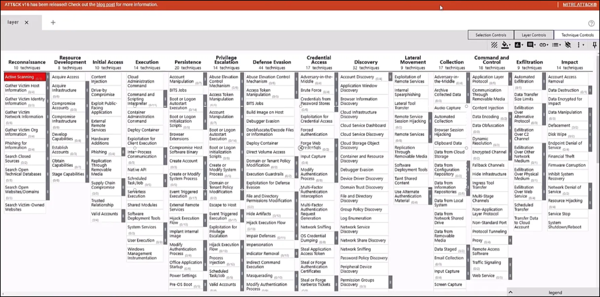

### Step 2: Create Layers for Each FIN Threat Actor

Start by identifying each FIN threat actor you want to investigate, such as FIN7, FIN8, FIN10, etc. For each threat actor, create an individual layer in Navigator.

1. **Create a New Layer for Each Threat Actor**:
    - Go to the + tab and then select Create New Layer.
    
    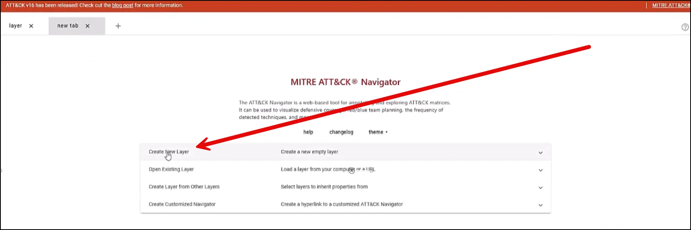
    
    - Choose Enterprise ATT&CK
    
    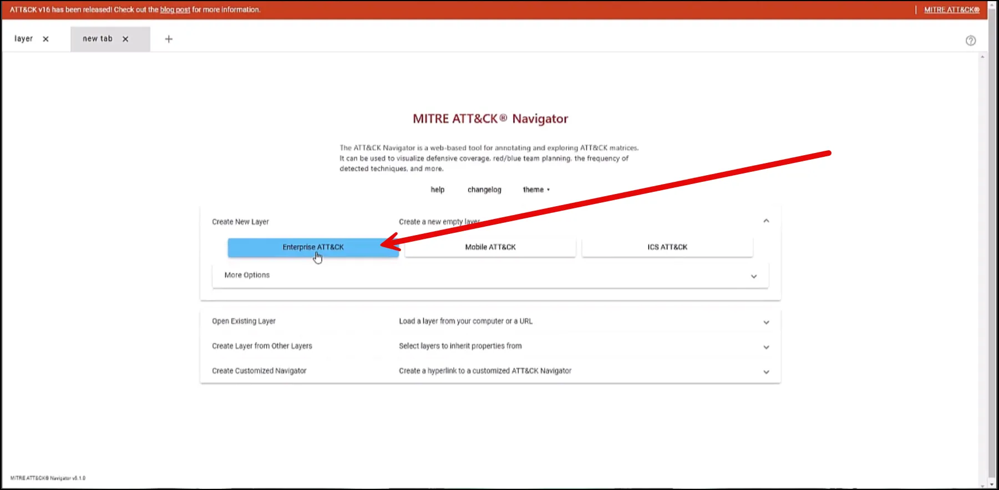
    
    - Go to layer controls and name each layer according to the threat actor it represents. In the screenshot below we will use FIN7.
    
    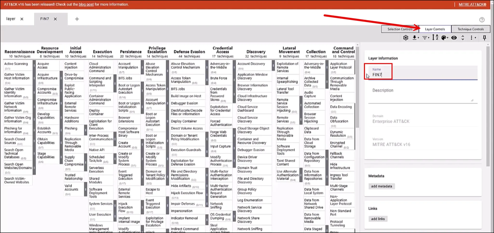
    
    - MITRE’s has used open source intelligence to map the techniques for many threat actors. to access them fo to Selection Controls → Select the magnifying glass → and type in FIN7.
    
    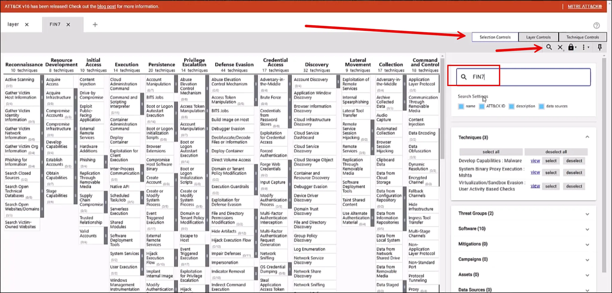
    
    - Choose select next to FIN7.
    
    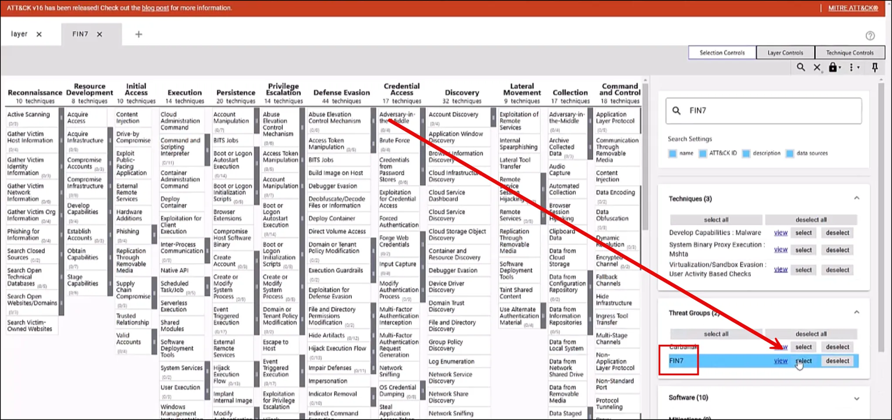
    
2. **Apply Color Coding for Visual Clarity**:
    
    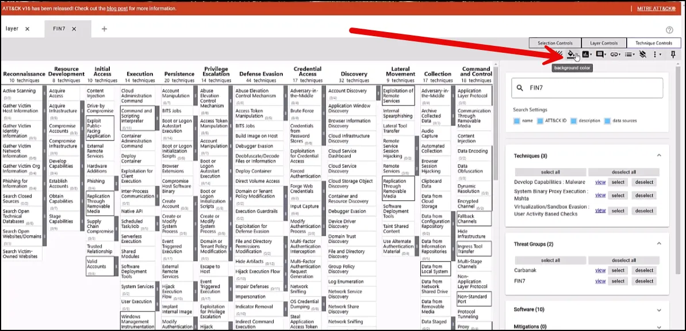
    

- We will use red to highlight the techniques.

### Step 3: Annotate and Score Techniques for Each Layer

After color-coding, we will score each technique as 1.

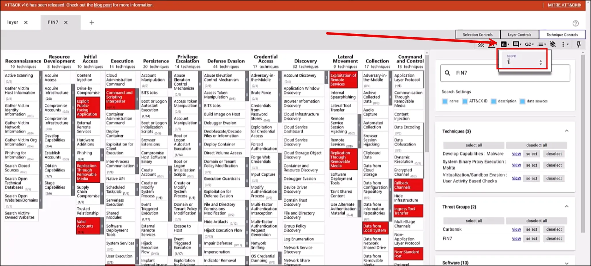

Go to Layer Controls → Color Palette → Give a low score of 1 and a high score of 3 → under preset, select green to red.

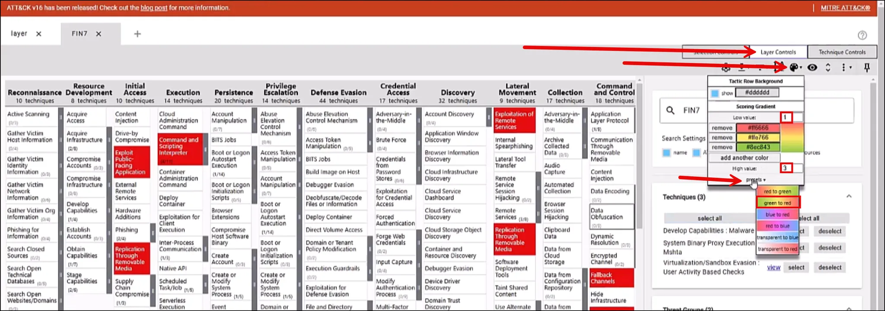

Repeat the process for FIN 8 and FIN 10

### Step 4: Combine Individual FIN Actor Layers into a New Aggregated Layer

With individual layers complete, combine these into a single, comprehensive layer for an overview of all FIN threat actors’ techniques. This merged layer will reveal overlaps between threat actors, helping to highlight common techniques and prioritize defenses against tactics likely to be encountered.

1. **Layer Stacking**:
    - Go to Select the + tab → Select Create Layer from Other Layers.
    
    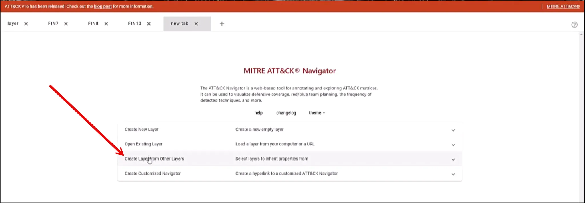
    
    - Choose the Enterprise ATT&CK v16 domain.
    
    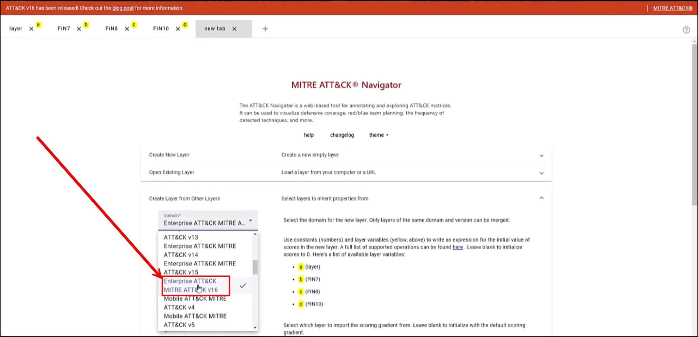
    
- In the score expression type in b+c+d

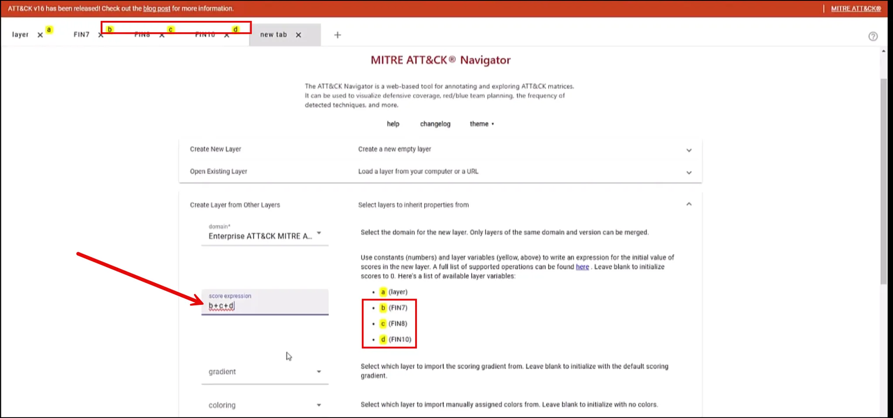

- Scroll to the bottom and select Create Layer.

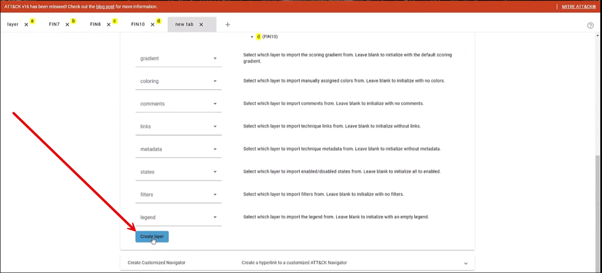

- Now you will have one consolidated layer using the green-to-red gradient to represent the frequency of techniques across all FIN threat actors:

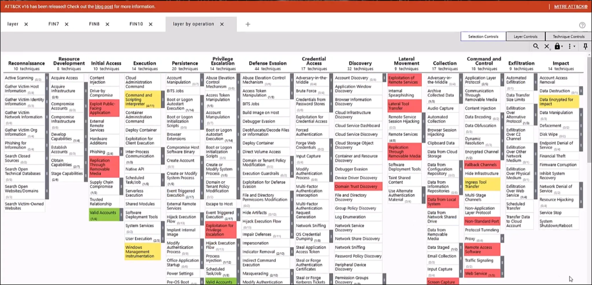

- Explanation
    - Techniques that only appear in one FIN layer can remain green.
    - Techniques present in multiple layers should be gradually shifted to yellow or red based on the number of occurrences, indicating higher risk or relevance.
    - By adjusting the color gradient, your team can quickly identify techniques that multiple FIN actors use, warranting additional attention in your defense strategy.

### Step 5: Interpret Results and Use the Combined Layer for Defense Prioritization

The combined layer offers a consolidated view of all FIN threat actors’ TTPs, allowing you to assess and refine your security posture:

- **Identify High-Risk Techniques**: Techniques that multiple FIN threat actors employ will stand out in red, providing a clear starting point for enhancing detection and defense strategies.
- **Highlight Gaps in Coverage**: Use the combined layer to identify any techniques not currently covered by existing security controls, allowing for focused improvements.
- **Enhance Collaboration and Reporting**: Export the combined layer to share with your security teams or stakeholders. Options like JSON, Excel, or image format (SVG) make it easy to present findings and collaborate on mitigation actions.

### Practical Application: Incorporating the Combined FIN Layer into the Atomic Red Team Emulation plan.

With the combined FIN layer in hand, we can effectively prioritize our Atomic Red Team threat emulation plan. 

### Conclusion

MITRE ATT&CK Navigator provides a versatile platform for mapping and visualizing the TTPs of threat actors, such as the FIN group. By creating individual layers for each FIN threat actor and combining them into an aggregated layer with a color-coded gradient, security teams can quickly identify high-priority techniques and make informed decisions about defense strategies and threat emulation. In the next video we will emulate those techniques using Atomic Red Team.