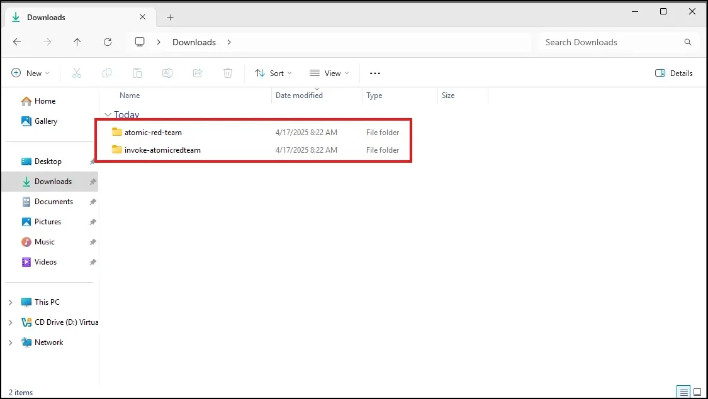
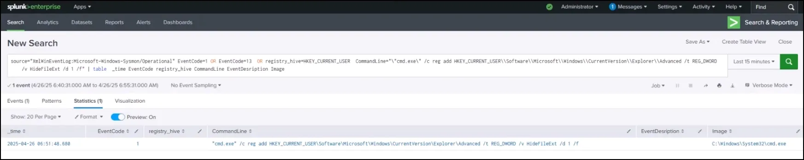

# Emulating FIN Actors: Part 2 Atomic Red Team

## Introduction

**Atomic Red Team** is an open-source project maintained by **Red Canary** that provides a library of **small, focused, and modular adversary simulation tests**. These tests are mapped directly to **MITRE ATT&CK techniques**, and they’re designed to help security teams:

- Validate detection and response capabilities
- Simulate real-world adversary behaviors in a controlled way
- Quickly test specific ATT&CK techniques ("atomic" = smallest possible test)

Each “atomic test” can be run as-is or customized for your environment. Think of it as a plug-and-play way to test your SOC's visibility and detection. For example, if you want to test T1059.001 (PowerShell), Atomic Red Team will give you a simple PowerShell script that mimics how an attacker might use it.

We will prioritize which “atomics” we will test, based on our findings from the last lesson using ATT&CK Navigator.


## Lab Setup

**Git**

Install git by downloading it from the link below.

[Git - Downloads](https://git-scm.com/downloads)


Choose 64-bit version


Install it by double-clicking the downloaded file and accepting all default selections.

**Confirm Defender and Real-time Protection is disabled.**

Even if you disabled Windows Defender, real-time protection may enable itself. Check to make sure it is disabled. It will alert on Atomic Red Team atomics.


**Atomic Red Team**

In earlier lessons we ran specific Atomic Red Team scripts to generate events; however, we will now install the entire library, tThis allows us to select specific atomics based on our previous lesson using ATT&CK Navigator.

The link below is to a custom PowerShell script that will clone two repositories required for Atomic Red Team.

[AtomicRedTeamSetupv1.ps1](https://ln5.sync.com/dl/aba879ab0#n8e7j6tq-8b9ts8qz-6a8rs5e2-p4regnie)

Open PowerShell as administrator and navigate to where you downloaded the script and run it.

You can check to see if both repositories were successfully downloaded by going to your downloads folder. You should see both atomic-red-team and invoke-atomicredteam folders.



Now we want to install and then import the invoke-atomicreadteam module. Run the command below to install:

```json
Install-Module -Name invoke-atomicredteam,powershell-yaml -Scope CurrentUser
```

Run the command below to import the module.

```json
Import-Module "Invoke-AtomicRedTeam.psd1" -Force
```

To ensure the module was imported successfully, run the command below.

```json
Get-Module
```

As seen below, it was.


Move both folders (atomic-red-team and invoke-atomicredteam) to the C: directory.


Change the name of the folder from atomic-red-team to AtomicRedTeam.


Take a snapshot of the VM.


## Details

Invoke-AtomicRedTeam is a PowerShell module to execute tests as defined in the [atomics folder](https://github.com/redcanaryco/atomic-red-team/tree/master/atomics) of Red Canary's Atomic Red Team project. The "atomics folder" contains a folder for each Technique defined by the [MITRE ATT&CK™ Framework](https://attack.mitre.org/matrices/enterprise/). Inside of each of these "T#" folders you'll find a **yaml** file that defines the attack procedures for each atomic test as well as an easier to read markdown (**md**) version of the same data.

We will select what atomics to run by reviewing the results of our ATT&CK navigator exercise we did in the previous lesson. We will start with the Modify Registry technique.


If we hover over it, it will give us the technique number, T1112. 

 


Navigate to the atomics folder and open the T1112 folder and open the .md file with notepad.


As seen above, the .md document gives information about each atomic test for technique T1112 (Registry Modification).

To run the first atomic for T1112 use the command below. Notice the dash (-) and the number for the specific atomic you want to run.

```json
Invoke-AtomicTest T1112-1
```

As seen below, it successfully ran the atomic for T1112-1.


**Checking coverage for T1112-1**

To check our coverage, we can open Splunk and use the following SPL.

```json
source="XmlWinEventLog:Microsoft-Windows-Sysmon/Operational" EventCode=1 OR EventCode=13  OR registry_hive=HKEY_CURRENT_USER | table  _time EventCode registry_hive CommandLine EventDescription Image
```

**SPL Line-by-line breakdown:**

| **SPL Part** | **Meaning** |
| --- | --- |
| `source="XmlWinEventLog:Microsoft-Windows-Sysmon/Operational"` | Search only in the Sysmon Operational event log. (Sysmon logs system monitoring events like process starts, registry changes, etc.) |
| `EventCode=1 OR EventCode=13 OR registry_hive=HKEY_CURRENT_USER` | Filter the events to match **either**:• `EventCode=1` (Process Create event)• `EventCode=13` (Registry Value Set event)• Any event where the `registry_hive` field equals `HKEY_CURRENT_USER` (even if the EventCode is something else). |
| ` | table _time EventCode registry_hive CommandLine EventDesription Image` |


As seen above we have some interesting results. Including the command line of our atomic test changing the registry value of the hide file extension.

We can refine our SPL by adding the command line.

```json
source="XmlWinEventLog:Microsoft-Windows-Sysmon/Operational" EventCode=1 OR EventCode=13  OR registry_hive=HKEY_CURRENT_USER  CommandLine="\"cmd.exe\" /c reg add HKEY_CURRENT_USER\\Software\\Microsoft\\Windows\\CurrentVersion\\Explorer\\Advanced /t REG_DWORD /v HideFileExt /d 1 /f" | table  _time EventCode registry_hive CommandLine EventDescription Image
```

**SPL Line-by-line breakdown:**

| **SPL Part** | **Meaning** |
| --- | --- |
| `source="XmlWinEventLog:Microsoft-Windows-Sysmon/Operational"` | Search only inside Sysmon’s Operational log events (this is where detailed process and registry activity is recorded). |
| `EventCode=1 OR EventCode=13 OR registry_hive=HKEY_CURRENT_USER` | Find events where **either**:• `EventCode=1` (Process Create)• `EventCode=13` (Registry Value Set)• `registry_hive=HKEY_CURRENT_USER` (any event touching HKEY_CURRENT_USER, regardless of event code). |
| `CommandLine="\"cmd.exe\" /c reg add HKEY_CURRENT_USER\\Software\\Microsoft\\Windows\\CurrentVersion\\Explorer\\Advanced /t REG_DWORD /v HideFileExt /d 1 /f"` | **AND** (on top of the previous filters) — Only keep events where the **exact CommandLine** equals:`"cmd.exe" /c reg add HKEY_CURRENT_USER\Software\Microsoft\Windows\CurrentVersion\Explorer\Advanced /t REG_DWORD /v HideFileExt /d 1 /f` |
| ` | table _time EventCode registry_hive CommandLine EventDescription Image` |

**In simple words:**

> "Show me events where either a process was created, or a registry value was set, or a registry key under HKEY_CURRENT_USER was touched, but only if the command line used was exactly a cmd.exe command that adds the HideFileExt value in the registry — and then display a nice table with the time, event code, registry hive, command, description, and image."
> 



As seen above, we got a specific result.

### Create an Alert

We can save the SPL as an Alert. 


You can view the alert by going to the Alert tab.


To test our alert, re-run the Atomic Red Team atomic.


Refresh the Alert page and we see the alert was triggered.


### Create a Dashboard

Go to the Dashboard tab and then select Create a new Dashboard.


Make the following selections.


Save the Alert SPL to an existing Dashboard.


Choose the Dashboard we just created, name the panel, and select Save to Dashboard.


Select View Dashboard.


As seen above our dashboard is populated with alerts. We can edit the pane to show only three of the same alert.


Then save the dashboard.