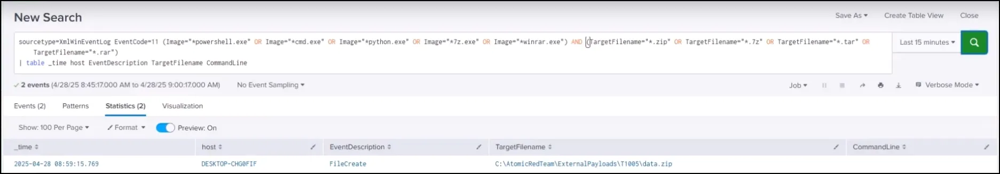

# Emulating FIN Actors: Part 3 Atomic Red Team (T1005)

## Introduction

Going back to our ATT&CK navigator layer we created for FIN actors, we will select the next Atomic Red Team atomic to test, T1005.


# **Data from Local System (T1005)**

Adversaries may search local system sources, such as file systems, configuration files, local databases, or virtual machine files, to find files of interest and sensitive data prior to Exfiltration.

Adversaries may do this using a [Command and Scripting Interpreter](https://attack.mitre.org/techniques/T1059), such as [cmd](https://attack.mitre.org/software/S0106) as well as a [Network Device CLI](https://attack.mitre.org/techniques/T1059/008), which have functionality to interact with the file system to gather information. Adversaries may also use [Automated Collection](https://attack.mitre.org/techniques/T1119) on the local system.


Atomic Test #1

```json
powershell
$startingDirectory = "#{starting_directory}"
$outputZip = "#{output_zip_folder_path}"
$fileExtensionsString = "#{file_extensions}"
$fileExtensions = $fileExtensionsString -split ", "
New-Item -Type Directory $outputZip -ErrorAction Ignore -Force | Out-Null

Function Search-Files {
param (
[string]$directory
)
$files = Get-ChildItem -Path $directory -File -Recurse | Where-Object {
$fileExtensions -contains $_.Extension.ToLower()
}
return $files
}

$foundFiles = Search-Files -directory $startingDirectory
if ($foundFiles.Count -gt 0) {
$foundFilePaths = $foundFiles.FullName
Compress-Archive -Path $foundFilePaths -DestinationPath "$outputZip\data.zip"

Write-Host "Zip file created: $outputZip\data.zip"
} else {
Write-Host "No files found with the specified extensions."
}
```

This Atomic Red Team test **recursively finds files with specific extensions, collects them, and zips them into one archive**, simulating the staging and collection of data for exfiltration or ransomware attacks.

# **Step-by-Step Breakdown**

| Step | Action | Purpose |
| --- | --- | --- |
| 1. | `$startingDirectory = "#{starting_directory}"` | Defines the root folder to start searching (user provides this input). |
| 2. | `$outputZip = "#{output_zip_folder_path}"` | Defines where the created `.zip` file will be saved. |
| 3. | `$fileExtensionsString = "#{file_extensions}"` | Takes a list of target file extensions (like "docx, pdf, xlsx"). |
| 4. | `$fileExtensions = $fileExtensionsString -split ", "` | Splits the extension list into an array (so it can check multiple types). |
| 5. | `New-Item -Type Directory $outputZip` | Makes sure the output folder exists (creates it if needed). |
| 6. | Defines `Function Search-Files` | Defines a function to **recursively** find matching files in all subdirectories. |
| 7. | `Get-ChildItem -Recurse` | Recursively walks through all folders under the starting directory. |
| 8. | `Where-Object { $fileExtensions -contains $_.Extension.ToLower() }` | Filters the files to only those with extensions matching the list. |
| 9. | `$foundFiles = Search-Files -directory $startingDirectory` | Runs the search function to get a list of target files. |
| 10. | If files are found → `Compress-Archive` | Compresses all found files into a single `data.zip` archive. |
| 11. | Else → `Write-Host "No files found..."` | If no matching files are found, outputs a message and exits. |

## Launch Atomic

```json
Invoke-AtomicTest T1005-1
```


## Check for Coverage

```json
sourcetype=XmlWinEventLog EventCode=11 (Image="*powershell.exe" OR Image="*cmd.exe" OR Image="python.exe" OR Image="7z.exe" OR Image="winrar.exe") AND (TargetFilename="*.zip" OR TargetFilename="*.7z" OR TargetFilename="*.tar" OR TargetFilename="**.rar")
| table _time host EventDescription TargetFilename CommandLine
```

This SPL **finds events** where **PowerShell, cmd, Python, 7-Zip, or WinRAR created** a file that is a **.zip, .7z, .tar, or .rar archive** and **shows** when it happened, on what computer, what file was created, and the exact command line used.

### **What Each Part Does:**

| Part | Meaning |
| --- | --- |
| `sourcetype=XmlWinEventLog` | Searching Windows event logs (typically Sysmon or security logs ingested as XML format). |
| `EventCode=11` | Focus only on **Sysmon Event ID 11**, which means **File Created**.  (New file written to disk.) |
| `(Image="*powershell.exe" OR Image="cmd.exe" OR Image="python.exe" OR Image="7z.exe" OR Image="winrar.exe")` | Filters to **only** processes like PowerShell, cmd, Python, 7-Zip, WinRAR that could create archive files. |
| `(TargetFilename="*.zip" OR TargetFilename="*.7z" OR TargetFilename="*.tar" OR TargetFilename="*.rar")` | Filters to files **created** that have compression-related extensions like `.zip`, `.7z`, `.tar`, `.rar`. |
| ` | table _time host EventDescription TargetFilename CommandLine` |

As seen below, we currently do not have coverage for this event.


## Update Sysmon configuration

By checking the Sysmon configuration file, we discovered that Event ID 11 is currently not logging file creations with a file extension of .zip, .7z, rar, or .tar. We can modify the Sysmon config file to include files with those file extensions.


## Restart Sysmon.

Navigate to \ProgramData\Sysmon

```json
.\Sysmon.exe -c C:\ProgramData\sysmon.xml
```


Run the Atomic Red Team atomic again.

```json
Invoke-AtomicTest T005-1
```


As seen below it is now successful. 



### Save as an Alert

Select the Save As dropdown and select Alert.


Make the selections shown seen below.


Run the atomic again.

```json
Invoke-AtomicTest T005-1
```


Go to the Alerts tab. As you can see below, the alert triggered.


### Save to Dashboard

Save the SPL to the Dashboard we created in the previous lesson.


Select the Dashboard and name the panel.


The screenshot below shows the Dashboard.

